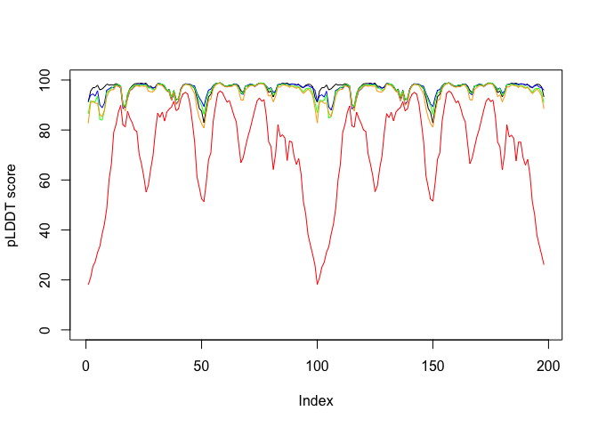
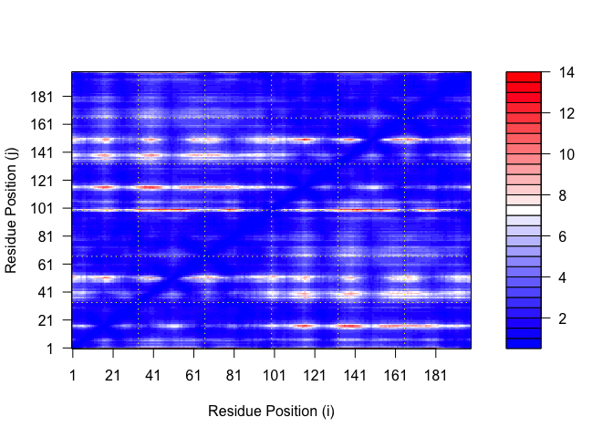
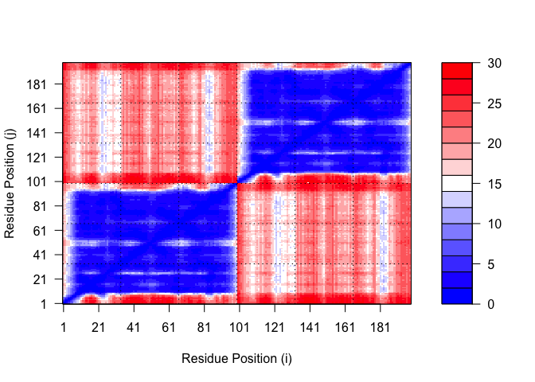
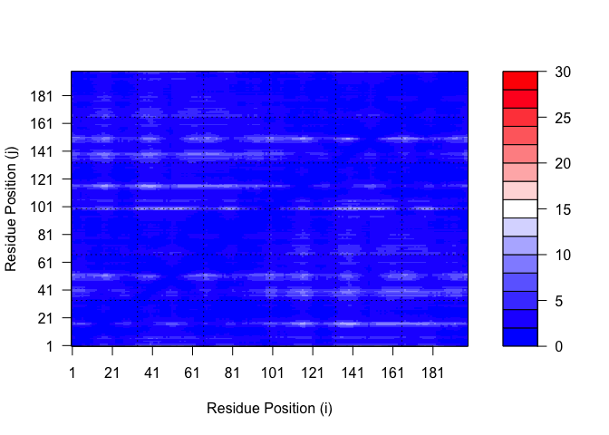
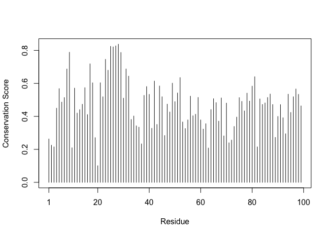
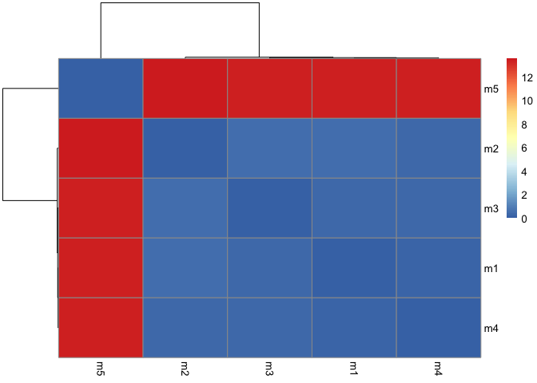

# Class 11 AlphaFold
Rocio Silenciario

Here we read the results from AlphaFold and try to interpret all the
models and quality score metrics:

``` r
library(bio3d)

pth <- "dimer_23119/"
pdb.files <- list.files(path=pth, full.names = TRUE, pattern= ".pdb")
```

Align and supperpose all these models

``` r
file.exists(pdb.files)
```

    [1] TRUE TRUE TRUE TRUE TRUE

``` r
pdbs <- pdbaln(pdb.files, fit = TRUE, exefile="msa")
```

    Reading PDB files:
    dimer_23119//dimer_23119_unrelaxed_rank_001_alphafold2_multimer_v3_model_2_seed_000.pdb
    dimer_23119//dimer_23119_unrelaxed_rank_002_alphafold2_multimer_v3_model_4_seed_000.pdb
    dimer_23119//dimer_23119_unrelaxed_rank_003_alphafold2_multimer_v3_model_1_seed_000.pdb
    dimer_23119//dimer_23119_unrelaxed_rank_004_alphafold2_multimer_v3_model_5_seed_000.pdb
    dimer_23119//dimer_23119_unrelaxed_rank_005_alphafold2_multimer_v3_model_3_seed_000.pdb
    .....

    Extracting sequences

    pdb/seq: 1   name: dimer_23119//dimer_23119_unrelaxed_rank_001_alphafold2_multimer_v3_model_2_seed_000.pdb 
    pdb/seq: 2   name: dimer_23119//dimer_23119_unrelaxed_rank_002_alphafold2_multimer_v3_model_4_seed_000.pdb 
    pdb/seq: 3   name: dimer_23119//dimer_23119_unrelaxed_rank_003_alphafold2_multimer_v3_model_1_seed_000.pdb 
    pdb/seq: 4   name: dimer_23119//dimer_23119_unrelaxed_rank_004_alphafold2_multimer_v3_model_5_seed_000.pdb 
    pdb/seq: 5   name: dimer_23119//dimer_23119_unrelaxed_rank_005_alphafold2_multimer_v3_model_3_seed_000.pdb 

``` r
plot(pdbs$b[1,], typ="l", ylim=c(0,100), ylab="pLDDT score")
lines(pdbs$b[2,],typ="l", col="blue")
lines(pdbs$b[3,],typ="l", col="green")
lines(pdbs$b[4,],typ="l", col="orange")
lines(pdbs$b[5,],typ="l", col="red")
```



``` r
pdbs$sse[1,]
```

    NULL

``` r
library(jsonlite)
pae_files <- list.files(path="dimer_23119/",
                        pattern=".*model.*\\.json",
                        full.names = TRUE)
```

``` r
# Listing of all PAE JSON files
pae1 <- read_json(pae_files[1],simplifyVector = TRUE)
pae5 <- read_json(pae_files[5],simplifyVector = TRUE)
attributes(pae1)
```

    $names
    [1] "plddt"   "max_pae" "pae"     "ptm"     "iptm"   

``` r
#Per-residue pLDDT scores 
#same as B-factor of PDB..
head(pae1$plddt) 
```

    [1] 91.19 95.56 96.94 96.94 97.94 96.06

``` r
pae1$max_pae
```

    [1] 13.80469

``` r
plot.dmat(pae1$pae, 
          xlab="Residue Position (i)",
          ylab="Residue Position (j)")
```



``` r
plot.dmat(pae5$pae, 
          xlab="Residue Position (i)",
          ylab="Residue Position (j)",
          grid.col = "black",
          zlim=c(0,30))
```



``` r
plot.dmat(pae1$pae, 
          xlab="Residue Position (i)",
          ylab="Residue Position (j)",
          grid.col = "black",
          zlim=c(0,30))
```



``` r
aln_file <- list.files(path="dimer_23119/",
                       pattern=".a3m$",
                        full.names = TRUE)
aln_file
```

    [1] "dimer_23119//dimer_23119.a3m"

``` r
aln <- read.fasta(aln_file[1], to.upper = TRUE)
```

    [1] " ** Duplicated sequence id's: 101 **"
    [2] " ** Duplicated sequence id's: 101 **"

How many sequences are in this alignment

``` r
dim(aln$ali)
```

    [1] 5378  132

We can score residue conservation in the alignment with the `conserv()`
function.

``` r
sim <- conserv(aln)
```

``` r
plotb3(sim[1:99],
       ylab="Conservation Score")
```



Note the conserved Active Site residues D25, T26, G27, A28. These
positions will stand out if we generate a consensus sequence with a high
cutoff value:

``` r
con <- consensus(aln, cutoff = 0.9)
con$seq
```

      [1] "-" "-" "-" "-" "-" "-" "-" "-" "-" "-" "-" "-" "-" "-" "-" "-" "-" "-"
     [19] "-" "-" "-" "-" "-" "-" "D" "T" "G" "A" "-" "-" "-" "-" "-" "-" "-" "-"
     [37] "-" "-" "-" "-" "-" "-" "-" "-" "-" "-" "-" "-" "-" "-" "-" "-" "-" "-"
     [55] "-" "-" "-" "-" "-" "-" "-" "-" "-" "-" "-" "-" "-" "-" "-" "-" "-" "-"
     [73] "-" "-" "-" "-" "-" "-" "-" "-" "-" "-" "-" "-" "-" "-" "-" "-" "-" "-"
     [91] "-" "-" "-" "-" "-" "-" "-" "-" "-" "-" "-" "-" "-" "-" "-" "-" "-" "-"
    [109] "-" "-" "-" "-" "-" "-" "-" "-" "-" "-" "-" "-" "-" "-" "-" "-" "-" "-"
    [127] "-" "-" "-" "-" "-" "-"

``` r
rd <- rmsd (pdbs)
```

    Warning in rmsd(pdbs): No indices provided, using the 198 non NA positions

``` r
rd
```

                                                                           dimer_23119_unrelaxed_rank_001_alphafold2_multimer_v3_model_2_seed_000
    dimer_23119_unrelaxed_rank_001_alphafold2_multimer_v3_model_2_seed_000                                                                  0.000
    dimer_23119_unrelaxed_rank_002_alphafold2_multimer_v3_model_4_seed_000                                                                  0.420
    dimer_23119_unrelaxed_rank_003_alphafold2_multimer_v3_model_1_seed_000                                                                  0.287
    dimer_23119_unrelaxed_rank_004_alphafold2_multimer_v3_model_5_seed_000                                                                  0.202
    dimer_23119_unrelaxed_rank_005_alphafold2_multimer_v3_model_3_seed_000                                                                 13.438
                                                                           dimer_23119_unrelaxed_rank_002_alphafold2_multimer_v3_model_4_seed_000
    dimer_23119_unrelaxed_rank_001_alphafold2_multimer_v3_model_2_seed_000                                                                  0.420
    dimer_23119_unrelaxed_rank_002_alphafold2_multimer_v3_model_4_seed_000                                                                  0.000
    dimer_23119_unrelaxed_rank_003_alphafold2_multimer_v3_model_1_seed_000                                                                  0.468
    dimer_23119_unrelaxed_rank_004_alphafold2_multimer_v3_model_5_seed_000                                                                  0.373
    dimer_23119_unrelaxed_rank_005_alphafold2_multimer_v3_model_3_seed_000                                                                 13.581
                                                                           dimer_23119_unrelaxed_rank_003_alphafold2_multimer_v3_model_1_seed_000
    dimer_23119_unrelaxed_rank_001_alphafold2_multimer_v3_model_2_seed_000                                                                  0.287
    dimer_23119_unrelaxed_rank_002_alphafold2_multimer_v3_model_4_seed_000                                                                  0.468
    dimer_23119_unrelaxed_rank_003_alphafold2_multimer_v3_model_1_seed_000                                                                  0.000
    dimer_23119_unrelaxed_rank_004_alphafold2_multimer_v3_model_5_seed_000                                                                  0.322
    dimer_23119_unrelaxed_rank_005_alphafold2_multimer_v3_model_3_seed_000                                                                 13.432
                                                                           dimer_23119_unrelaxed_rank_004_alphafold2_multimer_v3_model_5_seed_000
    dimer_23119_unrelaxed_rank_001_alphafold2_multimer_v3_model_2_seed_000                                                                  0.202
    dimer_23119_unrelaxed_rank_002_alphafold2_multimer_v3_model_4_seed_000                                                                  0.373
    dimer_23119_unrelaxed_rank_003_alphafold2_multimer_v3_model_1_seed_000                                                                  0.322
    dimer_23119_unrelaxed_rank_004_alphafold2_multimer_v3_model_5_seed_000                                                                  0.000
    dimer_23119_unrelaxed_rank_005_alphafold2_multimer_v3_model_3_seed_000                                                                 13.434
                                                                           dimer_23119_unrelaxed_rank_005_alphafold2_multimer_v3_model_3_seed_000
    dimer_23119_unrelaxed_rank_001_alphafold2_multimer_v3_model_2_seed_000                                                                 13.438
    dimer_23119_unrelaxed_rank_002_alphafold2_multimer_v3_model_4_seed_000                                                                 13.581
    dimer_23119_unrelaxed_rank_003_alphafold2_multimer_v3_model_1_seed_000                                                                 13.432
    dimer_23119_unrelaxed_rank_004_alphafold2_multimer_v3_model_5_seed_000                                                                 13.434
    dimer_23119_unrelaxed_rank_005_alphafold2_multimer_v3_model_3_seed_000                                                                  0.000

``` r
library(pheatmap)

colnames(rd) <- paste0("m",1:5)
rownames(rd) <- paste0("m",1:5)
pheatmap(rd)
```


