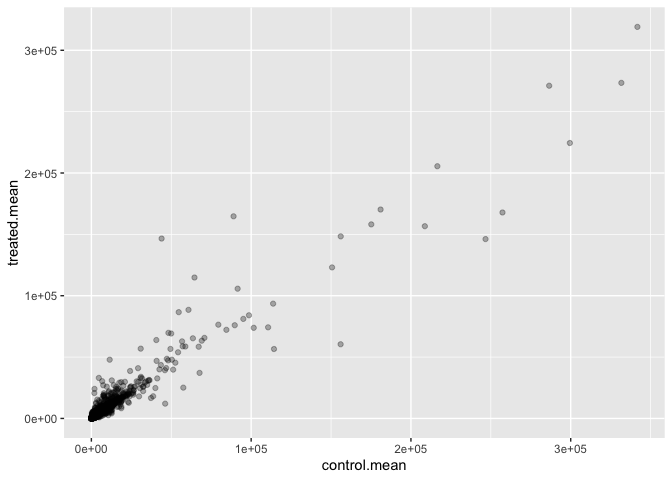
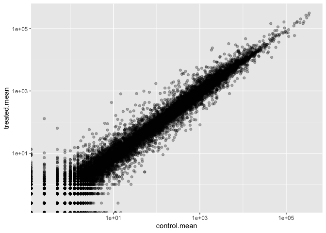
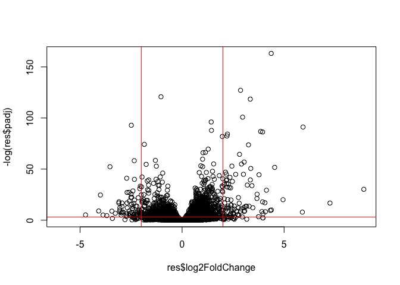
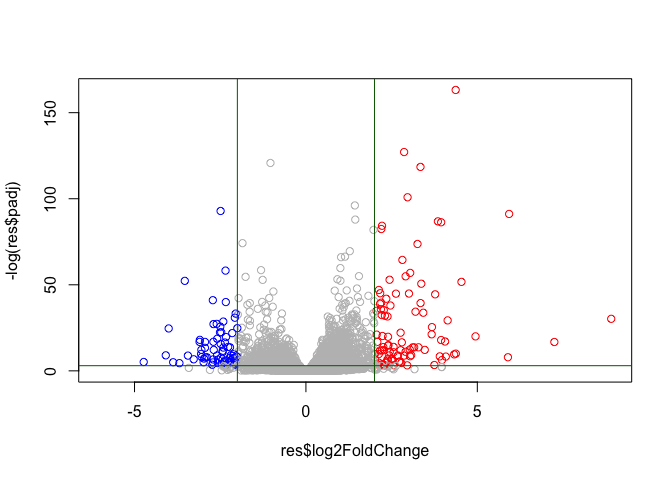
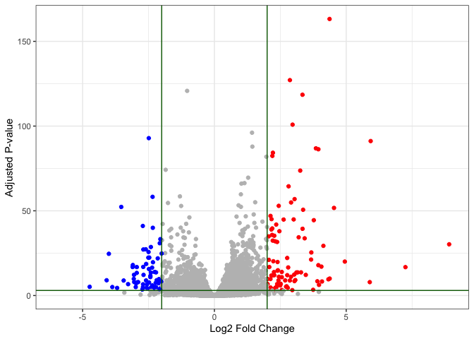

# Class 13: RNASeq Analysis
Rocio Silenciario
2025-05-13

- [Toy differential gene expression](#toy-differential-gene-expression)
- [Results figure: Volcano Plots](#results-figure-volcano-plots)
  - [We need to add gene annotation](#we-need-to-add-gene-annotation)
  - [Pathway Analysis](#pathway-analysis)
- [Pathway Analysis](#pathway-analysis-1)

\#Background Today we will analyze some RNA Sequencing data on the
effects of a common steroid drug on airway cell lines.

There are two main inputs we need for this analysis:

- `countData`: counts for genes in rows with experiments in the columns
  -`colData`: or metadata that tells us about the design of the
  experiment (i.e. what is in the columns of `countData`)

``` r
counts <- read.csv("airway_scaledcounts.csv", row.names = 1)
metadata<- read.csv("airway_metadata.csv", row.names =1)
```

> Q1. How many genes are in this dataset?

``` r
nrow(counts)
```

    [1] 38694

> Q2. How many ‘control’ cell lines do we have?

``` r
metadata$dex
```

    [1] "control" "treated" "control" "treated" "control" "treated" "control"
    [8] "treated"

``` r
table(metadata$dex)
```


    control treated 
          4       4 

``` r
sum(metadata$dex=="control")
```

    [1] 4

# Toy differential gene expression

Let’s try finding the average or mean of the “control” and “treated”
columns and see if they differ.

-1. First we need to find all “control” columns -2. Extract just the
“control” values for each gene -3. Calculate the `mean()` for each gene
“control” values

``` r
all(colnames(counts) == metadata$id)
```

    [1] TRUE

The \$dex columns tells me whether we have “control” or “treated”

``` r
control.inds <- metadata$dex == "control"
```

Extract just the “control” values for all genes

``` r
control.counts <- counts[,control.inds]
```

Calculate the mean value for each gene in these “control” columns

``` r
control.mean <- rowMeans(control.counts)
```

> Q3. Do the same for “treated” to get a `treated.mean`

``` r
treated.inds <-metadata$dex == "treated"
treated.counts <-  counts[,treated.inds]
treated.mean <- rowMeans(treated.counts)
head(treated.mean)
```

    ENSG00000000003 ENSG00000000005 ENSG00000000419 ENSG00000000457 ENSG00000000460 
             658.00            0.00          546.00          316.50           78.75 
    ENSG00000000938 
               0.00 

> Q4.Make a plot of `control.mean` vs `treated.mean`

Let’s store our mean values together in a data.frame for easier
book-keeping

``` r
meancounts <- data.frame(control.mean, treated.mean)
head(meancounts)
```

                    control.mean treated.mean
    ENSG00000000003       900.75       658.00
    ENSG00000000005         0.00         0.00
    ENSG00000000419       520.50       546.00
    ENSG00000000457       339.75       316.50
    ENSG00000000460        97.25        78.75
    ENSG00000000938         0.75         0.00

``` r
plot(meancounts)
```


``` r
library(ggplot2)
ggplot(meancounts)+
  aes(control.mean, treated.mean)+
  geom_point(alpha=0.3)
```



We totally need to log transform this data as it is so heavily skewed!

``` r
plot(meancounts, log="xy")
```

    Warning in xy.coords(x, y, xlabel, ylabel, log): 15032 x values <= 0 omitted
    from logarithmic plot

    Warning in xy.coords(x, y, xlabel, ylabel, log): 15281 y values <= 0 omitted
    from logarithmic plot


``` r
library(ggplot2)

ggplot(meancounts)+
  aes(control.mean, treated.mean)+
  geom_point(alpha=0.3)+
  scale_x_log10()+
  scale_y_log10()
```

    Warning in scale_x_log10(): log-10 transformation introduced infinite values.

    Warning in scale_y_log10(): log-10 transformation introduced infinite values.



``` r
# TREATED/CONTROL

log2(20/20)
```

    [1] 0

Doubling of the amount

``` r
log2(40/20)
```

    [1] 1

Half the amount

``` r
log2(10/20)
```

    [1] -1

A common “rule-of-thumb” is to focus on genes with a log2 “fold-change”
of +2 as so-called UP REGULATED and -2 as DOWN REGULATED.

``` r
log2(80/20)
```

    [1] 2

``` r
# 4x the original value
```

Let’s add a log2 fold-change value to our `meancounts` data.frame

``` r
meancounts$log2fc <- log2(meancounts$treated.mean/meancounts$control.mean)
head(meancounts)
```

                    control.mean treated.mean      log2fc
    ENSG00000000003       900.75       658.00 -0.45303916
    ENSG00000000005         0.00         0.00         NaN
    ENSG00000000419       520.50       546.00  0.06900279
    ENSG00000000457       339.75       316.50 -0.10226805
    ENSG00000000460        97.25        78.75 -0.30441833
    ENSG00000000938         0.75         0.00        -Inf

> Q. Remove any “zero count” genes from our dataset for further analysis

``` r
to.keep <- rowSums(meancounts[,1:2]==0) == 0
sum(to.keep)
```

    [1] 21817

``` r
#genes with non-zero counts
```

``` r
mycounts <- meancounts[to.keep,]
head(mycounts)
```

                    control.mean treated.mean      log2fc
    ENSG00000000003       900.75       658.00 -0.45303916
    ENSG00000000419       520.50       546.00  0.06900279
    ENSG00000000457       339.75       316.50 -0.10226805
    ENSG00000000460        97.25        78.75 -0.30441833
    ENSG00000000971      5219.00      6687.50  0.35769358
    ENSG00000001036      2327.00      1785.75 -0.38194109

> Q. How many genees are “up” regulated at a log2fc threshold of +2?

``` r
sum(mycounts$log2fc >= 2)
```

    [1] 314

> Q. How many genees are “down” regulated at a log2fc threshold of -2?

``` r
sum(mycounts$log2fc <= -2)
```

    [1] 485

Hold on, we are missing stats. Is it actually significant? We need to
calculate the p-value to make sure of this.

\#DESeq2 analysis

Let’s do this properly and consider the stats - are the differences in
the means significant?

We will use DESeq2 to do this:

``` r
library(DESeq2)
```

The first function we will use for this package sets up the input in the
particular format that DESeq2 wants:

``` r
dds <- DESeqDataSetFromMatrix(countData = counts, colData= metadata, design = ~dex)
```

    Warning in DESeqDataSet(se, design = design, ignoreRank): some variables in
    design formula are characters, converting to factors

We can now run our DESeq analysis

``` r
dds <- DESeq(dds)
```

    estimating size factors

    estimating dispersions

    gene-wise dispersion estimates

    mean-dispersion relationship

    final dispersion estimates

    fitting model and testing

``` r
res <- results(dds)
```

Peak at results

``` r
head(res)
```

    log2 fold change (MLE): dex treated vs control 
    Wald test p-value: dex treated vs control 
    DataFrame with 6 rows and 6 columns
                      baseMean log2FoldChange     lfcSE      stat    pvalue
                     <numeric>      <numeric> <numeric> <numeric> <numeric>
    ENSG00000000003 747.194195     -0.3507030  0.168246 -2.084470 0.0371175
    ENSG00000000005   0.000000             NA        NA        NA        NA
    ENSG00000000419 520.134160      0.2061078  0.101059  2.039475 0.0414026
    ENSG00000000457 322.664844      0.0245269  0.145145  0.168982 0.8658106
    ENSG00000000460  87.682625     -0.1471420  0.257007 -0.572521 0.5669691
    ENSG00000000938   0.319167     -1.7322890  3.493601 -0.495846 0.6200029
                         padj
                    <numeric>
    ENSG00000000003  0.163035
    ENSG00000000005        NA
    ENSG00000000419  0.176032
    ENSG00000000457  0.961694
    ENSG00000000460  0.815849
    ENSG00000000938        NA

# Results figure: Volcano Plots

Plot of the Log2fc vs the P-value

``` r
plot(res$log2FoldChange, res$padj)
```


This p-value data is again heavily skewed, so let’s log transfrom it.

``` r
plot(res$log2FoldChange, log(res$padj))
```


We can flip the y-axis by adding a minus sign. This will make it easier
to interpret

``` r
plot(res$log2FoldChange, -log(res$padj))
abline(v=-2, col="red")
abline(v=+2, col="red")
abline(h=-log(0.05), col="red")
```



Let’s add some color.

``` r
mycols <- rep("gray", nrow(res))
mycols [res$log2FoldChange <= -2] <- "blue"
mycols [res$log2FoldChange >= +2] <- "red"
mycols [res$padj >= 0.05 ] <- "gray"
plot(res$log2FoldChange, -log(res$padj), col=mycols)
abline(v=-2, col="darkgreen")
abline(v=+2, col="darkgreen")
abline(h=-log(0.05), col="darkgreen")
```



``` r
head(res)
```

    log2 fold change (MLE): dex treated vs control 
    Wald test p-value: dex treated vs control 
    DataFrame with 6 rows and 6 columns
                      baseMean log2FoldChange     lfcSE      stat    pvalue
                     <numeric>      <numeric> <numeric> <numeric> <numeric>
    ENSG00000000003 747.194195     -0.3507030  0.168246 -2.084470 0.0371175
    ENSG00000000005   0.000000             NA        NA        NA        NA
    ENSG00000000419 520.134160      0.2061078  0.101059  2.039475 0.0414026
    ENSG00000000457 322.664844      0.0245269  0.145145  0.168982 0.8658106
    ENSG00000000460  87.682625     -0.1471420  0.257007 -0.572521 0.5669691
    ENSG00000000938   0.319167     -1.7322890  3.493601 -0.495846 0.6200029
                         padj
                    <numeric>
    ENSG00000000003  0.163035
    ENSG00000000005        NA
    ENSG00000000419  0.176032
    ENSG00000000457  0.961694
    ENSG00000000460  0.815849
    ENSG00000000938        NA

Make a ggplot volcano plot with colors and lines as annotation along
with nice axis labels.

``` r
mycols <- rep("gray", nrow(res))
mycols [res$log2FoldChange <= -2] <- "blue"
mycols [res$log2FoldChange >= +2] <- "red"
mycols [res$padj >= 0.05 ] <- "gray"

ggplot(as.data.frame((res)))+ aes(res$log2FoldChange,-log(res$padj))+
  geom_point(col=mycols, ) + xlab("Log2 Fold Change")+ ylab("Adjusted P-value")+ geom_vline(xintercept = -2, col= "darkgreen") +
geom_vline(xintercept = +2, col= "darkgreen") + geom_hline(yintercept = -log(0.05), col="darkgreen") + theme_bw()
```

    Warning: Removed 23549 rows containing missing values or values outside the scale range
    (`geom_point()`).



## We need to add gene annotation

Gene symbols and different database IDs

## Pathway Analysis

Find what biological pathways my differentially expressed genes
participate in.

Pathway analysis (also known as gene set analysis or over-representation
analysis), aims to reduce the complexity of interpreting.

``` r
head(res)
```

    log2 fold change (MLE): dex treated vs control 
    Wald test p-value: dex treated vs control 
    DataFrame with 6 rows and 6 columns
                      baseMean log2FoldChange     lfcSE      stat    pvalue
                     <numeric>      <numeric> <numeric> <numeric> <numeric>
    ENSG00000000003 747.194195     -0.3507030  0.168246 -2.084470 0.0371175
    ENSG00000000005   0.000000             NA        NA        NA        NA
    ENSG00000000419 520.134160      0.2061078  0.101059  2.039475 0.0414026
    ENSG00000000457 322.664844      0.0245269  0.145145  0.168982 0.8658106
    ENSG00000000460  87.682625     -0.1471420  0.257007 -0.572521 0.5669691
    ENSG00000000938   0.319167     -1.7322890  3.493601 -0.495846 0.6200029
                         padj
                    <numeric>
    ENSG00000000003  0.163035
    ENSG00000000005        NA
    ENSG00000000419  0.176032
    ENSG00000000457  0.961694
    ENSG00000000460  0.815849
    ENSG00000000938        NA

We first need to add gene symbols (e.g. HBB etc.) so we know what genes
we are dealing with. We need to translate between Ensemble, ids that we
have in the rownames of `res`.

Install from bioconductor with \`BiocManager::install(“AnnotationDbi”)
Bio

``` r
library(AnnotationDbi)
library(org.Hs.eg.db)
```

What different database ID types can I translate between.

``` r
columns(org.Hs.eg.db)
```

     [1] "ACCNUM"       "ALIAS"        "ENSEMBL"      "ENSEMBLPROT"  "ENSEMBLTRANS"
     [6] "ENTREZID"     "ENZYME"       "EVIDENCE"     "EVIDENCEALL"  "GENENAME"    
    [11] "GENETYPE"     "GO"           "GOALL"        "IPI"          "MAP"         
    [16] "OMIM"         "ONTOLOGY"     "ONTOLOGYALL"  "PATH"         "PFAM"        
    [21] "PMID"         "PROSITE"      "REFSEQ"       "SYMBOL"       "UCSCKG"      
    [26] "UNIPROT"     

Let’s “map” between “ENSEMBL” and “SYMBOL” (i.e. gene symbol).

``` r
res$symbol <- mapIds(x=org.Hs.eg.db, 
              keys=rownames(res),
             keytype = "ENSEMBL",
              column= "SYMBOL")
```

    'select()' returned 1:many mapping between keys and columns

``` r
head(res)
```

    log2 fold change (MLE): dex treated vs control 
    Wald test p-value: dex treated vs control 
    DataFrame with 6 rows and 7 columns
                      baseMean log2FoldChange     lfcSE      stat    pvalue
                     <numeric>      <numeric> <numeric> <numeric> <numeric>
    ENSG00000000003 747.194195     -0.3507030  0.168246 -2.084470 0.0371175
    ENSG00000000005   0.000000             NA        NA        NA        NA
    ENSG00000000419 520.134160      0.2061078  0.101059  2.039475 0.0414026
    ENSG00000000457 322.664844      0.0245269  0.145145  0.168982 0.8658106
    ENSG00000000460  87.682625     -0.1471420  0.257007 -0.572521 0.5669691
    ENSG00000000938   0.319167     -1.7322890  3.493601 -0.495846 0.6200029
                         padj      symbol
                    <numeric> <character>
    ENSG00000000003  0.163035      TSPAN6
    ENSG00000000005        NA        TNMD
    ENSG00000000419  0.176032        DPM1
    ENSG00000000457  0.961694       SCYL3
    ENSG00000000460  0.815849       FIRRM
    ENSG00000000938        NA         FGR

Add a few more ID mappings including “GENENAME” and “ENTREZID”.

``` r
res$name <- mapIds(x=org.Hs.eg.db, 
              keys=rownames(res),
             keytype = "ENSEMBL",
              column= "GENENAME")
```

    'select()' returned 1:many mapping between keys and columns

``` r
res$entrez <- mapIds(x=org.Hs.eg.db, 
              keys=rownames(res),
             keytype = "ENSEMBL",
              column= "ENTREZID")
```

    'select()' returned 1:many mapping between keys and columns

``` r
head(res)
```

    log2 fold change (MLE): dex treated vs control 
    Wald test p-value: dex treated vs control 
    DataFrame with 6 rows and 9 columns
                      baseMean log2FoldChange     lfcSE      stat    pvalue
                     <numeric>      <numeric> <numeric> <numeric> <numeric>
    ENSG00000000003 747.194195     -0.3507030  0.168246 -2.084470 0.0371175
    ENSG00000000005   0.000000             NA        NA        NA        NA
    ENSG00000000419 520.134160      0.2061078  0.101059  2.039475 0.0414026
    ENSG00000000457 322.664844      0.0245269  0.145145  0.168982 0.8658106
    ENSG00000000460  87.682625     -0.1471420  0.257007 -0.572521 0.5669691
    ENSG00000000938   0.319167     -1.7322890  3.493601 -0.495846 0.6200029
                         padj      symbol                   name      entrez
                    <numeric> <character>            <character> <character>
    ENSG00000000003  0.163035      TSPAN6          tetraspanin 6        7105
    ENSG00000000005        NA        TNMD            tenomodulin       64102
    ENSG00000000419  0.176032        DPM1 dolichyl-phosphate m..        8813
    ENSG00000000457  0.961694       SCYL3 SCY1 like pseudokina..       57147
    ENSG00000000460  0.815849       FIRRM FIGNL1 interacting r..       55732
    ENSG00000000938        NA         FGR FGR proto-oncogene, ..        2268

Let’s ensure to save our annotated results to a file.

``` r
write.csv(res, file="my_annotated_results.csv")
```

# Pathway Analysis

Install the packages we need for pathway analysis: Run in your R console
(i.e. not your Quarto Doc!)

`BiocManager::install( c("pathview", "gage"), "gageData"))`

``` r
library(pathview)
```

    ##############################################################################
    Pathview is an open source software package distributed under GNU General
    Public License version 3 (GPLv3). Details of GPLv3 is available at
    http://www.gnu.org/licenses/gpl-3.0.html. Particullary, users are required to
    formally cite the original Pathview paper (not just mention it) in publications
    or products. For details, do citation("pathview") within R.

    The pathview downloads and uses KEGG data. Non-academic uses may require a KEGG
    license agreement (details at http://www.kegg.jp/kegg/legal.html).
    ##############################################################################

``` r
library(gage)
```

``` r
library(gageData)
```

Let’s take a peak at gageData.

``` r
data(kegg.sets.hs)

#Examine the first 2 pathways in this kegg set for humans
head(kegg.sets.hs, 2)
```

    $`hsa00232 Caffeine metabolism`
    [1] "10"   "1544" "1548" "1549" "1553" "7498" "9"   

    $`hsa00983 Drug metabolism - other enzymes`
     [1] "10"     "1066"   "10720"  "10941"  "151531" "1548"   "1549"   "1551"  
     [9] "1553"   "1576"   "1577"   "1806"   "1807"   "1890"   "221223" "2990"  
    [17] "3251"   "3614"   "3615"   "3704"   "51733"  "54490"  "54575"  "54576" 
    [25] "54577"  "54578"  "54579"  "54600"  "54657"  "54658"  "54659"  "54963" 
    [33] "574537" "64816"  "7083"   "7084"   "7172"   "7363"   "7364"   "7365"  
    [41] "7366"   "7367"   "7371"   "7372"   "7378"   "7498"   "79799"  "83549" 
    [49] "8824"   "8833"   "9"      "978"   

To run pathway analysis we will use the `gage()` function and it
requires a wee “vector of importance”. We will use our Log2FC results
from our `res` object.

``` r
foldchanges = res$log2FoldChange
names(foldchanges) = res$entrez
head(foldchanges)
```

           7105       64102        8813       57147       55732        2268 
    -0.35070302          NA  0.20610777  0.02452695 -0.14714205 -1.73228897 

``` r
# Get the results
keggres = gage(foldchanges, gsets=kegg.sets.hs)
```

What’s in the returned `keggres` object

``` r
attributes(keggres)
```

    $names
    [1] "greater" "less"    "stats"  

``` r
head(keggres$less)
```

                                                             p.geomean stat.mean
    hsa05332 Graft-versus-host disease                    0.0004250461 -3.473346
    hsa04940 Type I diabetes mellitus                     0.0017820293 -3.002352
    hsa05310 Asthma                                       0.0020045888 -3.009050
    hsa04672 Intestinal immune network for IgA production 0.0060434515 -2.560547
    hsa05330 Allograft rejection                          0.0073678825 -2.501419
    hsa04340 Hedgehog signaling pathway                   0.0133239547 -2.248547
                                                                 p.val      q.val
    hsa05332 Graft-versus-host disease                    0.0004250461 0.09053483
    hsa04940 Type I diabetes mellitus                     0.0017820293 0.14232581
    hsa05310 Asthma                                       0.0020045888 0.14232581
    hsa04672 Intestinal immune network for IgA production 0.0060434515 0.31387180
    hsa05330 Allograft rejection                          0.0073678825 0.31387180
    hsa04340 Hedgehog signaling pathway                   0.0133239547 0.47300039
                                                          set.size         exp1
    hsa05332 Graft-versus-host disease                          40 0.0004250461
    hsa04940 Type I diabetes mellitus                           42 0.0017820293
    hsa05310 Asthma                                             29 0.0020045888
    hsa04672 Intestinal immune network for IgA production       47 0.0060434515
    hsa05330 Allograft rejection                                36 0.0073678825
    hsa04340 Hedgehog signaling pathway                         56 0.0133239547

We can pass our foldchange vector (our results) together with any of
these highlighted pathway IDs to see how our genes

``` r
pathview(gene.data=foldchanges, pathway.id = "hsa05310")
```

    'select()' returned 1:1 mapping between keys and columns

    Info: Working in directory /Users/rociosilenciario/Documents/BIMM 143/BIMM143_github/Lab13

    Info: Writing image file hsa05310.pathview.png


