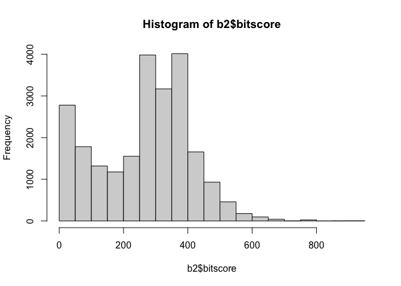
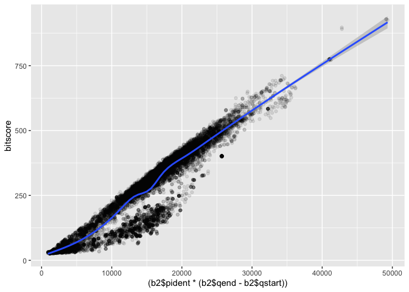

# Class 16
Rocio Silenciario

``` r
library(ggplot2)
b <- read.csv("results1.csv",stringsAsFactors = FALSE)
split_data <- do.call(rbind, strsplit(b[[1]], "\t"))

mydata_clean <- as.data.frame(split_data, stringsAsFactors = FALSE)

b2 <- colnames(mydata_clean) <- c("query_id", "subject_id", "pident", "length", "mismatch", 
                            "gapopen", "qstart", "qend", "sstart", "send", "evalue", "bitscore")
colnames(mydata_clean) <- c("query_id", "subject_id", "pident", "length", "mismatch",
  "gapopen", "qstart", "qend", "sstart", "send", "evalue", "bitscore")
b2 <- mydata_clean
```

Make a histogram of the `$bitscore` values. You may want to set the
optional `breaks` to be a larger number (e.g. `breaks=30`).

``` r
num_cols <- c("pident", "length", "mismatch", "gapopen", "qstart", "qend", "sstart", "send", "evalue", "bitscore")
b2[num_cols] <- lapply(b2[num_cols], as.numeric)
hist(b2$bitscore, breaks = 30)
```



Plot of pident \* (qend -qstart) vs bitscore:

``` r
ggplot(b2, aes((b2$pident * (b2$qend - b2$qstart)), bitscore)) + geom_point(alpha=0.1) + geom_smooth()
```

    Warning: Use of `b2$pident` is discouraged.
    ℹ Use `pident` instead.

    Warning: Use of `b2$qend` is discouraged.
    ℹ Use `qend` instead.

    Warning: Use of `b2$qstart` is discouraged.
    ℹ Use `qstart` instead.

    Warning: Use of `b2$pident` is discouraged.
    ℹ Use `pident` instead.

    Warning: Use of `b2$qend` is discouraged.
    ℹ Use `qend` instead.

    Warning: Use of `b2$qstart` is discouraged.
    ℹ Use `qstart` instead.



Instructions: Type your answers to the following 3 questions in the
boxed blue form space provided. Save your answers and upload to our
GradeScope site. There are 10 total points on offer. You can use any
resources but please no communication (electronic or otherwise) with
your fellow students regarding these questions. Thank you!

> Q1. \[6pt\] List the UNIX bash shell commands to: \> open a secure
> shell on a remote machine:

ssh username@remote_host

> > **make a new folder in your home area called “test”:**

mkdir ~/test

> > **download this file
> > “https://files.rcsb.org/download/5P21.pdb.gz”:**

wget https://files.rcsb.org/download/5P21.pdb.gz

> > **unzip/decompress it the file:**

gunzip 5P21.pdb.gz

> > **print to screen the first 6 lines:**

head -n 6 5P21.pdb

> > **print to lines beginning with ATOM to a new file called
> > “coords.pdb”:**

grep “^ATOM” 5P21.pdb \> coords.pdb

> Q2. List the UNIX commands to copy securely the file “myaln.fa” in
> your current working directory to your home area on the remote machine
> “biglabcluster.ucsd.edu”:

scp myaln.fa rociosilenciario@biglabcluster.ucsd.edu

> Q3. The alignment file “myaln.fa” is not in your current working
> directory but it is in your “Downloads” directory. Write the R code to
> import this alignment to the named object “aln” using a function from
> the bio3d package.

`library(bio3d)` `aln <- read.fasta("~/Downloads/myaln.fa")`
