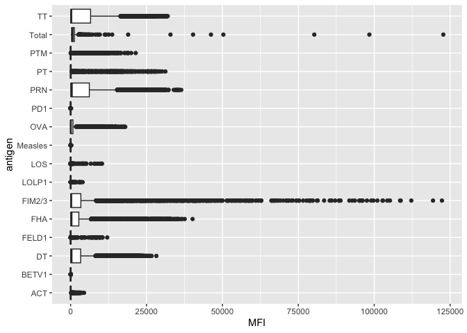
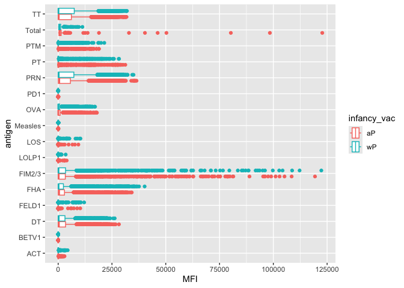
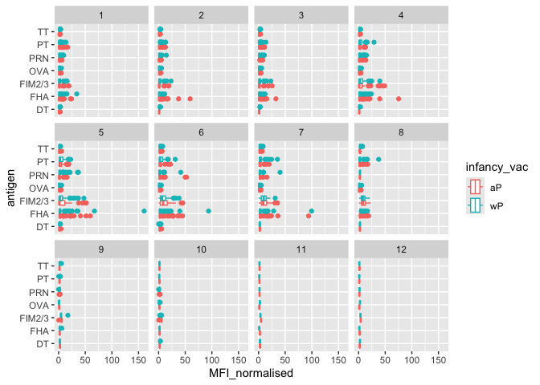

# Class 18: Pertussis mini project
Rocio Silenciario

- [Background](#background)
- [Examining cases of Pertussis by
  year](#examining-cases-of-pertussis-by-year)
- [Enter the CMI-PB Project](#enter-the-cmi-pb-project)

## Background

Pertussis (a.k.a. whooping cough) is a common lung infection caused by
the bacteria *B. Pertussis*.

The CDC tracks cases of Pertussis in the US:
https://www.cdc.gov/pertussis/php/surveillance/pertussis-cases-by-year.html

## Examining cases of Pertussis by year

We can use the **datapasta** package to scrape case numbers from the CDC
website.

> Q. Make a plot of Pertussis cases per year using ggplot.

``` r
library("ggplot2")
cases <- ggplot(cdc) + aes(year, cases) + geom_point() + geom_line()

cases
```


> Q2. Add some key time points in our history of interaction with
> Pertussis to our plot. These include the wP roll-out (the first
> vaccine) in 1946, and switch to aP in 1996.

We can use `geom_vline()` for this.

``` r
cases + geom_vline(xintercept= 1946, col="blue") + geom_vline(xintercept = 1996, col="red") + geom_vline(xintercept=2020, col="purple")
```


Once the wP vaccine rolled out in 1946, there was a significant decrease
in the number of Pertussis cases by year. Notably, ten years later after
the switch to the aP vaccine in 1996, yearly cases began to rise again.
In 2020, there was a drop in yearly cases that could be contributed to
the COVID-19 pandemic and isolation. After the pandemic ended, we can
see that yearly cases of Pertussis began to rise again.

Mounting evidence suggests that the newer **aP** vaccine is less
effective over the long term that the older **wP** vaccine that it
replaced. In other words, vaccine protection wanes more rapidly with aP
than with wP.

## Enter the CMI-PB Project

CMI-PB (Computational Models of Immunity - Pertussis boost) major goal
is to investigate how the immune responds differently with aP vs wP
vaccinated individuals ad be able to predict this early on.

CMI-PB makes all their collected data freely available and they store it
in a database composed of different tables. Here we will access a few of
these.

We can use the **jsonlite** package to read this data

``` r
library(jsonlite)

subject <- read_json("https://www.cmi-pb.org/api/v5_1/subject", simplifyVector = TRUE)
head(subject)
```

      subject_id infancy_vac biological_sex              ethnicity  race
    1          1          wP         Female Not Hispanic or Latino White
    2          2          wP         Female Not Hispanic or Latino White
    3          3          wP         Female                Unknown White
    4          4          wP           Male Not Hispanic or Latino Asian
    5          5          wP           Male Not Hispanic or Latino Asian
    6          6          wP         Female Not Hispanic or Latino White
      year_of_birth date_of_boost      dataset
    1    1986-01-01    2016-09-12 2020_dataset
    2    1968-01-01    2019-01-28 2020_dataset
    3    1983-01-01    2016-10-10 2020_dataset
    4    1988-01-01    2016-08-29 2020_dataset
    5    1991-01-01    2016-08-29 2020_dataset
    6    1988-01-01    2016-10-10 2020_dataset

> Q. How many subjects (i.e. enrolled people) are there in this
> database?

``` r
nrow(subject)
```

    [1] 172

> Q. How many “aP” and “wP” subjects are there?

``` r
table(subject$infancy_vac)
```


    aP wP 
    87 85 

> Q. How many Male/Female are in the dataset?

``` r
table(subject$biological_sex)
```


    Female   Male 
       112     60 

> Q. How about gender and race numbers?

``` r
table(subject$race, subject$biological_sex)
```

                                               
                                                Female Male
      American Indian/Alaska Native                  0    1
      Asian                                         32   12
      Black or African American                      2    3
      More Than One Race                            15    4
      Native Hawaiian or Other Pacific Islander      1    1
      Unknown or Not Reported                       14    7
      White                                         48   32

> Q. Is this representative of the US population?

NO

Let’s read another data table from CMI-PB

``` r
specimen <- read_json("https://www.cmi-pb.org/api/v5_1/specimen", simplifyVector = TRUE)
ab <- read_json("https://www.cmi-pb.org/api/v5_1/plasma_ab_titer", simplifyVector = TRUE)
```

Wee peak at these

``` r
head(specimen)
```

      specimen_id subject_id actual_day_relative_to_boost
    1           1          1                           -3
    2           2          1                            1
    3           3          1                            3
    4           4          1                            7
    5           5          1                           11
    6           6          1                           32
      planned_day_relative_to_boost specimen_type visit
    1                             0         Blood     1
    2                             1         Blood     2
    3                             3         Blood     3
    4                             7         Blood     4
    5                            14         Blood     5
    6                            30         Blood     6

We want to “join” these tables together to get all our information
together. For this we will use **dplyr** package and the `inner_join()`
function.

``` r
library(dplyr)
```


    Attaching package: 'dplyr'

    The following objects are masked from 'package:stats':

        filter, lag

    The following objects are masked from 'package:base':

        intersect, setdiff, setequal, union

``` r
meta <- inner_join(subject, specimen)
```

    Joining with `by = join_by(subject_id)`

``` r
head(meta)
```

      subject_id infancy_vac biological_sex              ethnicity  race
    1          1          wP         Female Not Hispanic or Latino White
    2          1          wP         Female Not Hispanic or Latino White
    3          1          wP         Female Not Hispanic or Latino White
    4          1          wP         Female Not Hispanic or Latino White
    5          1          wP         Female Not Hispanic or Latino White
    6          1          wP         Female Not Hispanic or Latino White
      year_of_birth date_of_boost      dataset specimen_id
    1    1986-01-01    2016-09-12 2020_dataset           1
    2    1986-01-01    2016-09-12 2020_dataset           2
    3    1986-01-01    2016-09-12 2020_dataset           3
    4    1986-01-01    2016-09-12 2020_dataset           4
    5    1986-01-01    2016-09-12 2020_dataset           5
    6    1986-01-01    2016-09-12 2020_dataset           6
      actual_day_relative_to_boost planned_day_relative_to_boost specimen_type
    1                           -3                             0         Blood
    2                            1                             1         Blood
    3                            3                             3         Blood
    4                            7                             7         Blood
    5                           11                            14         Blood
    6                           32                            30         Blood
      visit
    1     1
    2     2
    3     3
    4     4
    5     5
    6     6

``` r
head(ab)
```

      specimen_id isotype is_antigen_specific antigen        MFI MFI_normalised
    1           1     IgE               FALSE   Total 1110.21154       2.493425
    2           1     IgE               FALSE   Total 2708.91616       2.493425
    3           1     IgG                TRUE      PT   68.56614       3.736992
    4           1     IgG                TRUE     PRN  332.12718       2.602350
    5           1     IgG                TRUE     FHA 1887.12263      34.050956
    6           1     IgE                TRUE     ACT    0.10000       1.000000
       unit lower_limit_of_detection
    1 UG/ML                 2.096133
    2 IU/ML                29.170000
    3 IU/ML                 0.530000
    4 IU/ML                 6.205949
    5 IU/ML                 4.679535
    6 IU/ML                 2.816431

One more “join” to get ab data and meta all together

``` r
abdata<- inner_join(meta, ab)
```

    Joining with `by = join_by(specimen_id)`

``` r
head(abdata)
```

      subject_id infancy_vac biological_sex              ethnicity  race
    1          1          wP         Female Not Hispanic or Latino White
    2          1          wP         Female Not Hispanic or Latino White
    3          1          wP         Female Not Hispanic or Latino White
    4          1          wP         Female Not Hispanic or Latino White
    5          1          wP         Female Not Hispanic or Latino White
    6          1          wP         Female Not Hispanic or Latino White
      year_of_birth date_of_boost      dataset specimen_id
    1    1986-01-01    2016-09-12 2020_dataset           1
    2    1986-01-01    2016-09-12 2020_dataset           1
    3    1986-01-01    2016-09-12 2020_dataset           1
    4    1986-01-01    2016-09-12 2020_dataset           1
    5    1986-01-01    2016-09-12 2020_dataset           1
    6    1986-01-01    2016-09-12 2020_dataset           1
      actual_day_relative_to_boost planned_day_relative_to_boost specimen_type
    1                           -3                             0         Blood
    2                           -3                             0         Blood
    3                           -3                             0         Blood
    4                           -3                             0         Blood
    5                           -3                             0         Blood
    6                           -3                             0         Blood
      visit isotype is_antigen_specific antigen        MFI MFI_normalised  unit
    1     1     IgE               FALSE   Total 1110.21154       2.493425 UG/ML
    2     1     IgE               FALSE   Total 2708.91616       2.493425 IU/ML
    3     1     IgG                TRUE      PT   68.56614       3.736992 IU/ML
    4     1     IgG                TRUE     PRN  332.12718       2.602350 IU/ML
    5     1     IgG                TRUE     FHA 1887.12263      34.050956 IU/ML
    6     1     IgE                TRUE     ACT    0.10000       1.000000 IU/ML
      lower_limit_of_detection
    1                 2.096133
    2                29.170000
    3                 0.530000
    4                 6.205949
    5                 4.679535
    6                 2.816431

``` r
dim(abdata)
```

    [1] 61956    20

> Q. How many Ab isotypes are there in this dataset?

``` r
table(abdata$isotype)
```


      IgE   IgG  IgG1  IgG2  IgG3  IgG4 
     6698  7265 11993 12000 12000 12000 

> Q. How many different antigens are measured?

``` r
table(abdata$antigen)
```


        ACT   BETV1      DT   FELD1     FHA  FIM2/3   LOLP1     LOS Measles     OVA 
       1970    1970    6318    1970    6712    6318    1970    1970    1970    6318 
        PD1     PRN      PT     PTM   Total      TT 
       1970    6712    6712    1970     788    6318 

> Q. Make a boxplot of antigen levels across the whole dataset (MFI vs
> antigen)?

``` r
ggplot(abdata) + aes(MFI,antigen) + geom_boxplot()
```

    Warning: Removed 1 row containing non-finite outside the scale range
    (`stat_boxplot()`).



> Q. Are there obvious differences between aP and wP values?

``` r
ggplot(abdata) + aes(MFI,antigen, col=infancy_vac) + geom_boxplot()
```

    Warning: Removed 1 row containing non-finite outside the scale range
    (`stat_boxplot()`).



``` r
igg <- abdata |> 
  filter(isotype == "IgG")
head(igg)
```

      subject_id infancy_vac biological_sex              ethnicity  race
    1          1          wP         Female Not Hispanic or Latino White
    2          1          wP         Female Not Hispanic or Latino White
    3          1          wP         Female Not Hispanic or Latino White
    4          1          wP         Female Not Hispanic or Latino White
    5          1          wP         Female Not Hispanic or Latino White
    6          1          wP         Female Not Hispanic or Latino White
      year_of_birth date_of_boost      dataset specimen_id
    1    1986-01-01    2016-09-12 2020_dataset           1
    2    1986-01-01    2016-09-12 2020_dataset           1
    3    1986-01-01    2016-09-12 2020_dataset           1
    4    1986-01-01    2016-09-12 2020_dataset           2
    5    1986-01-01    2016-09-12 2020_dataset           2
    6    1986-01-01    2016-09-12 2020_dataset           2
      actual_day_relative_to_boost planned_day_relative_to_boost specimen_type
    1                           -3                             0         Blood
    2                           -3                             0         Blood
    3                           -3                             0         Blood
    4                            1                             1         Blood
    5                            1                             1         Blood
    6                            1                             1         Blood
      visit isotype is_antigen_specific antigen        MFI MFI_normalised  unit
    1     1     IgG                TRUE      PT   68.56614       3.736992 IU/ML
    2     1     IgG                TRUE     PRN  332.12718       2.602350 IU/ML
    3     1     IgG                TRUE     FHA 1887.12263      34.050956 IU/ML
    4     2     IgG                TRUE      PT   41.38442       2.255534 IU/ML
    5     2     IgG                TRUE     PRN  174.89761       1.370393 IU/ML
    6     2     IgG                TRUE     FHA  246.00957       4.438960 IU/ML
      lower_limit_of_detection
    1                 0.530000
    2                 6.205949
    3                 4.679535
    4                 0.530000
    5                 6.205949
    6                 4.679535

Same boxplot of antigens as before

``` r
ggplot(igg) + aes(MFI_normalised, antigen, col=infancy_vac) + geom_boxplot() + facet_wrap(~visit)
```



Focus in further in just one of these antigens - let’s pick **PT**
(Pertussis Toxin, one of the main toxins of the bacteria)
**2021_dataset** again for **IgG** antibody isotypes

``` r
table(igg$dataset)
```


    2020_dataset 2021_dataset 2022_dataset 2023_dataset 
            1182         1617         1456         3010 

``` r
pt_igg <- abdata |>
      filter(isotype == "IgG", 
         antigen == "PT", 
         dataset =="2021_dataset")
```

``` r
dim(pt_igg)
```

    [1] 231  20

``` r
ggplot(pt_igg)+aes(actual_day_relative_to_boost, MFI_normalised, colour = infancy_vac, group=subject_id) +geom_point() +geom_line() + theme_bw() + geom_vline(xintercept = 0) + geom_vline(xintercept = 14)
```


