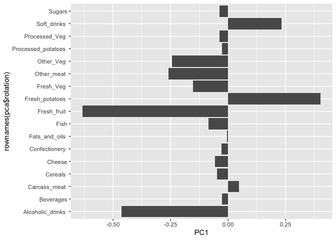

# Lab 7: Machine Learning 1
Rocio Silenciario

- [Clustering](#clustering)
  - [K-means](#k-means)
  - [Hierarchical Clustering](#hierarchical-clustering)
- [Data import](#data-import)
  - [PCA to the rescue](#pca-to-the-rescue)

Today we will explore unsupervised machine learning methods starting
with clustering and dimensionality reduction.

## Clustering

To start let’s make up some data to cluster where we know what the
answer should be. The `rnorm()` function will help us here.

``` r
hist(rnorm(10000, mean=3))
```


Return 30 numbers centered on -3

``` r
tmp <- c(rnorm(30, mean=-3), rnorm(30, mean=3))

x <- cbind(x=tmp, y=rev(tmp))
x
```

                  x         y
     [1,] -1.605867  2.258668
     [2,] -2.401226  1.833691
     [3,] -2.205326  2.524628
     [4,] -3.840342  3.074813
     [5,] -5.083945  2.463819
     [6,] -3.144576  2.455900
     [7,] -2.451533  5.178356
     [8,] -2.644532  3.850242
     [9,] -3.431570  2.385155
    [10,] -3.816419  3.807924
    [11,] -3.316871  3.359454
    [12,] -1.460633  4.594812
    [13,] -3.025338  2.985111
    [14,] -1.987334  1.943306
    [15,] -3.176365  2.693340
    [16,] -3.130206  1.862281
    [17,] -3.884772  2.484434
    [18,] -3.208344  4.021377
    [19,] -3.621977  2.867253
    [20,] -3.558568  2.222677
    [21,] -2.572759  4.859906
    [22,] -3.048514  4.459850
    [23,] -1.713547  2.575431
    [24,] -4.120320  3.704116
    [25,] -3.401743  1.510789
    [26,] -2.638286  1.569869
    [27,] -2.234941  3.259167
    [28,] -3.322221  2.845592
    [29,] -4.640187  2.740136
    [30,] -1.734994  2.039020
    [31,]  2.039020 -1.734994
    [32,]  2.740136 -4.640187
    [33,]  2.845592 -3.322221
    [34,]  3.259167 -2.234941
    [35,]  1.569869 -2.638286
    [36,]  1.510789 -3.401743
    [37,]  3.704116 -4.120320
    [38,]  2.575431 -1.713547
    [39,]  4.459850 -3.048514
    [40,]  4.859906 -2.572759
    [41,]  2.222677 -3.558568
    [42,]  2.867253 -3.621977
    [43,]  4.021377 -3.208344
    [44,]  2.484434 -3.884772
    [45,]  1.862281 -3.130206
    [46,]  2.693340 -3.176365
    [47,]  1.943306 -1.987334
    [48,]  2.985111 -3.025338
    [49,]  4.594812 -1.460633
    [50,]  3.359454 -3.316871
    [51,]  3.807924 -3.816419
    [52,]  2.385155 -3.431570
    [53,]  3.850242 -2.644532
    [54,]  5.178356 -2.451533
    [55,]  2.455900 -3.144576
    [56,]  2.463819 -5.083945
    [57,]  3.074813 -3.840342
    [58,]  2.524628 -2.205326
    [59,]  1.833691 -2.401226
    [60,]  2.258668 -1.605867

Make a plot of `x`

``` r
plot(x)
```


### K-means

The main function in “base” R for K-means clustering is called
`kmeans()`:

``` r
km <- kmeans(x, 2)
km
```

    K-means clustering with 2 clusters of sizes 30, 30

    Cluster means:
              x         y
    1  2.947704 -3.014109
    2 -3.014109  2.947704

    Clustering vector:
     [1] 2 2 2 2 2 2 2 2 2 2 2 2 2 2 2 2 2 2 2 2 2 2 2 2 2 2 2 2 2 2 1 1 1 1 1 1 1 1
    [39] 1 1 1 1 1 1 1 1 1 1 1 1 1 1 1 1 1 1 1 1 1 1

    Within cluster sum of squares by cluster:
    [1] 50.57577 50.57577
     (between_SS / total_SS =  91.3 %)

    Available components:

    [1] "cluster"      "centers"      "totss"        "withinss"     "tot.withinss"
    [6] "betweenss"    "size"         "iter"         "ifault"      

The `kmeans()` function returns a “list” with 9 components. You can see
the named components of any list with the `attributes()` function.

``` r
attributes(km)
```

    $names
    [1] "cluster"      "centers"      "totss"        "withinss"     "tot.withinss"
    [6] "betweenss"    "size"         "iter"         "ifault"      

    $class
    [1] "kmeans"

> Q. How many points are in each cluster?

``` r
km$size
```

    [1] 30 30

> Q. Cluster assignment/membership vector?

``` r
km$cluster
```

     [1] 2 2 2 2 2 2 2 2 2 2 2 2 2 2 2 2 2 2 2 2 2 2 2 2 2 2 2 2 2 2 1 1 1 1 1 1 1 1
    [39] 1 1 1 1 1 1 1 1 1 1 1 1 1 1 1 1 1 1 1 1 1 1

> Q. Cluster centers?

``` r
km$centers
```

              x         y
    1  2.947704 -3.014109
    2 -3.014109  2.947704

> Q. Make a plot of our `kmeans()` results showing cluster assignment
> using different colors for each cluster/group of points and cluster
> centers in blue?

``` r
plot(x, col=km$cluster)
points(km$centers, col="blue", pch=15, cex=2)
```


> Q. Run `kmeans()` again on `x` and this cluster into 4
> groups/clusters, and plot the same result figure as above.

``` r
fm <- kmeans(x, 4)
fm
```

    K-means clustering with 4 clusters of sizes 9, 14, 30, 7

    Cluster means:
              x         y
    1  2.013076 -2.313170
    2  2.863552 -3.713105
    3 -3.014109  2.947704
    4  4.317673 -2.517322

    Clustering vector:
     [1] 3 3 3 3 3 3 3 3 3 3 3 3 3 3 3 3 3 3 3 3 3 3 3 3 3 3 3 3 3 3 1 2 2 4 1 1 2 1
    [39] 4 4 2 2 4 2 1 2 1 2 4 2 2 2 4 4 2 2 2 1 1 1

    Within cluster sum of squares by cluster:
    [1]  4.425331  7.523954 50.575773  4.538120
     (between_SS / total_SS =  94.3 %)

    Available components:

    [1] "cluster"      "centers"      "totss"        "withinss"     "tot.withinss"
    [6] "betweenss"    "size"         "iter"         "ifault"      

``` r
plot(x, col=fm$cluster)
points(fm$centers, col="blue", pch=15, cex=1.5)
```


> **key-point**: K-means clustering is super popular but can be
> miss-used. One big limitation is that it can impose a clustering
> patern on your data even if clear natural grouping don’t exist -
> i.e. it does what you tell it to do in terms of `centers`.

### Hierarchical Clustering

The main function in “base” R for Hierarchical Clustering is called
`hclust()`

You can’t just pass our dataset as is into `hclust()`, you must give
“distance matrix” as input. We can get this from the `dist()` function
in R.

``` r
d <- dist(x)
hc <- hclust(d)
hc
```


    Call:
    hclust(d = d)

    Cluster method   : complete 
    Distance         : euclidean 
    Number of objects: 60 

The results of `hclust()` don’t have a useful `print()` method but do
have a special `plot()` method.

``` r
plot(hc)
abline(h=8, col="red")
```


To get our main cluster assignment (membership vector) we need to “cut”
the tree at the big goal posts…

``` r
grps <- cutree(hc, h=8)
grps
```

     [1] 1 1 1 1 1 1 1 1 1 1 1 1 1 1 1 1 1 1 1 1 1 1 1 1 1 1 1 1 1 1 2 2 2 2 2 2 2 2
    [39] 2 2 2 2 2 2 2 2 2 2 2 2 2 2 2 2 2 2 2 2 2 2

To determine how many vectors are in each assignment when using hc:

``` r
table(grps)
```

    grps
     1  2 
    30 30 

``` r
plot(x, col=grps)
```


Hierarchical Clustering is distinct in that the dendrogram (tree figure)
can reveal the potential grouping in your data (unlike K-means).

\#Principal Component Analysis (PCA)

PCA is a common and highly useful dimensionality reduction technique
used in many fields - particularly bioinformatics.

Here we will analyze some data from the UK on food consumption.

## Data import

``` r
url <- "https://tinyurl.com/UK-foods"
x <- read.csv(url)
head(x)
```

                   X England Wales Scotland N.Ireland
    1         Cheese     105   103      103        66
    2  Carcass_meat      245   227      242       267
    3    Other_meat      685   803      750       586
    4           Fish     147   160      122        93
    5 Fats_and_oils      193   235      184       209
    6         Sugars     156   175      147       139

``` r
rownames(x) <- x[,1]
x <- x[,-1]
head(x)
```

                   England Wales Scotland N.Ireland
    Cheese             105   103      103        66
    Carcass_meat       245   227      242       267
    Other_meat         685   803      750       586
    Fish               147   160      122        93
    Fats_and_oils      193   235      184       209
    Sugars             156   175      147       139

Setting the first column to be the names instead of numbers:

``` r
x <- read.csv(url, row.names =1)
head(x)
```

                   England Wales Scotland N.Ireland
    Cheese             105   103      103        66
    Carcass_meat       245   227      242       267
    Other_meat         685   803      750       586
    Fish               147   160      122        93
    Fats_and_oils      193   235      184       209
    Sugars             156   175      147       139

``` r
barplot(as.matrix(x), beside=T, col=rainbow(nrow(x)))
```


``` r
barplot(as.matrix(x), beside=F, col=rainbow(nrow(x)))
```


One conventional plot that can be useful is called a “pairs” plot.

``` r
pairs(x, col=rainbow(10), pch=16)
```


This figure shows the similarities between the four countries as
represented by the linear pattern present when comparing England, Wales
and Scotland to each other. When comparing N. Ireland to the former
three, we can see there is more variability in the plots, as they do not
follow the same linear pattern as the others.

### PCA to the rescue

The main function in base R for PCA is called `prcomp()`.

``` r
pca <- prcomp(t(x))
summary(pca)
```

    Importance of components:
                                PC1      PC2      PC3       PC4
    Standard deviation     324.1502 212.7478 73.87622 2.921e-14
    Proportion of Variance   0.6744   0.2905  0.03503 0.000e+00
    Cumulative Proportion    0.6744   0.9650  1.00000 1.000e+00

The `prcomp` function returns a list object of our result with five
attributes/components.

``` r
attributes(pca)
```

    $names
    [1] "sdev"     "rotation" "center"   "scale"    "x"       

    $class
    [1] "prcomp"

The two main “results” in here are `pca$x` and `pca$rotation`. The first
of these (`pca$x`) contains the score of the data on the new PC axis -
we use these to make our “PCA plot”.

``` r
pca$x
```

                     PC1         PC2        PC3           PC4
    England   -144.99315   -2.532999 105.768945 -9.152022e-15
    Wales     -240.52915 -224.646925 -56.475555  5.560040e-13
    Scotland   -91.86934  286.081786 -44.415495 -6.638419e-13
    N.Ireland  477.39164  -58.901862  -4.877895  1.329771e-13

``` r
library(ggplot2)
library(ggrepel)

# Make a plot of pca$x with PC1 vs PC2

ggplot(pca$x) +
  aes(PC1,PC2, label=rownames(pca$x))+
  geom_point()+
  geom_text_repel()
```


This figure shows the variability between the four countries plotted in
a PC1 vs PC2 plot. We can see that Scotland, England and Wales are very
similar to each other according to the PC1 axis, while N. Ireland is
not. According to the PC2 axis we can see that there is some
similarities between N. Ireland and England, but there is still a
significant amount of variability between N. Ireland and Wales &
Scotland.

The second major result is contained in the `pca$rotation` object or
component. Let’s plot this to see what PCA is picking up…

``` r
ggplot(pca$rotation)+
  aes(PC1, rownames(pca$rotation))+
  geom_col()
```



This figure shows the ways in which N. Ireland is different than
England, Wales and Scotland. N. Ireland differences are highlighted by
the bars pointing to the positive numbers, with soft drinks, fresh
potatoes, and carcass meat being the main foods that N. Ireland
consumes. The bars pointing to the negative. numbers represent the food
consumed mostly by England, Wales and Scotland.
