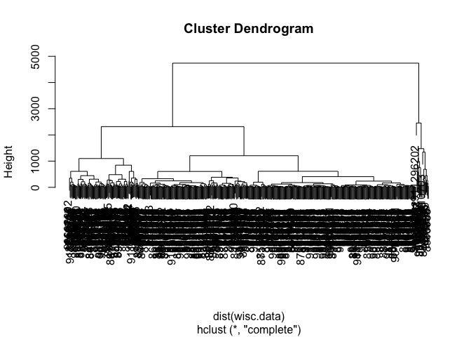

# Lab 8: Breast Cancer Mini Project
Rocio Silenciario

- [Background](#background)
- [Data Import](#data-import)
- [Clustering](#clustering)
- [Principal Component Analysis](#principal-component-analysis)
  - [The importance of data scaling](#the-importance-of-data-scaling)
  - [PCA of wisc.data](#pca-of-wiscdata)
- [Combining Methods](#combining-methods)
  - [Clustering on PCA results](#clustering-on-pca-results)
- [7. Prediction](#7-prediction)

## Background

This mini-project explores unsupervised learning techniques applied to
the Wisconsin Breast Cancer Diagnostic Data Set, which contains
measurements of human breast mass cell nuclei. The project guides the
user through exploratory data analysis, performing and interpreting
Principal Component Analysis (PCA) to reduce the dimensionality of the
data while retaining variance, and applying hierarchical clustering with
different linkage methods. It also includes an optional section on
K-means clustering for comparison. The ultimate goal is to combine PCA
and clustering to better separate benign and malignant cell samples,
evaluating the results using metrics like sensitivity and specificity,
and finally demonstrating how to predict the classification of new
samples using the developed PCA model.

## Data Import

Our data come from the U. of Wisconsin Medical Center

``` r
wisc.df <-read.csv("WisconsinCancer.csv", row.names=1)
```

> Q. How many patients/samples are in this dataset?

``` r
nrow(wisc.df)
```

    [1] 569

> Q2. How many of the observations have a malignant diagnosis?

``` r
table(wisc.df$diagnosis)
```


      B   M 
    357 212 

> Q3. How many variables/features in the data are suffixed with \_mean?

``` r
length(grep("mean",colnames(wisc.df),value =TRUE))
```

    [1] 10

There is a diagnosis column that is the clinician consensus that I want
to exclude from any further analysis. We will come back later and
compare our results to this diagnosis.

``` r
diagnosis <- as.factor(wisc.df$diagnosis)
head(diagnosis)
```

    [1] M M M M M M
    Levels: B M

Now we can remove it from the `wisc.df`

``` r
wisc.data <- wisc.df[,-1]
```

## Clustering

Let’s try a `hclust()`

``` r
hc <- hclust(dist(wisc.data))
plot(hc)
```



We can extract clusters from this rather poor dendrogram/tree with the
`cutree()`

``` r
groups <- cutree(hc, k=2)
```

How many individuals in each cluster?

``` r
table(groups)
```

    groups
      1   2 
    549  20 

``` r
table(diagnosis)
```

    diagnosis
      B   M 
    357 212 

We can generate a cross-table that compares our cluster `groups` vector
with our `diagnosis` vector values.

``` r
table(diagnosis, groups)
```

             groups
    diagnosis   1   2
            B 357   0
            M 192  20

## Principal Component Analysis

### The importance of data scaling

The main function for PCA in base R is `prcomp()` it has a default input
parameter of `scale=FALSE`.

``` r
#prcomp()
head(mtcars)
```

                       mpg cyl disp  hp drat    wt  qsec vs am gear carb
    Mazda RX4         21.0   6  160 110 3.90 2.620 16.46  0  1    4    4
    Mazda RX4 Wag     21.0   6  160 110 3.90 2.875 17.02  0  1    4    4
    Datsun 710        22.8   4  108  93 3.85 2.320 18.61  1  1    4    1
    Hornet 4 Drive    21.4   6  258 110 3.08 3.215 19.44  1  0    3    1
    Hornet Sportabout 18.7   8  360 175 3.15 3.440 17.02  0  0    3    2
    Valiant           18.1   6  225 105 2.76 3.460 20.22  1  0    3    1

We could do a PCA of this data as is and it could be mis-leading…

``` r
pc <-prcomp(mtcars)
biplot(pc)
```


Let’s look at the mean values of each column and their standard
deviation.

``` r
colMeans(mtcars)
```

           mpg        cyl       disp         hp       drat         wt       qsec 
     20.090625   6.187500 230.721875 146.687500   3.596563   3.217250  17.848750 
            vs         am       gear       carb 
      0.437500   0.406250   3.687500   2.812500 

``` r
apply(mtcars, 2, sd)
```

            mpg         cyl        disp          hp        drat          wt 
      6.0269481   1.7859216 123.9386938  68.5628685   0.5346787   0.9784574 
           qsec          vs          am        gear        carb 
      1.7869432   0.5040161   0.4989909   0.7378041   1.6152000 

We can “scale” this data before PCA to get a much better representation
and analysis of all the columns.

``` r
mtscale <-scale(mtcars)
mtscale
```

                                mpg        cyl        disp          hp        drat
    Mazda RX4            0.15088482 -0.1049878 -0.57061982 -0.53509284  0.56751369
    Mazda RX4 Wag        0.15088482 -0.1049878 -0.57061982 -0.53509284  0.56751369
    Datsun 710           0.44954345 -1.2248578 -0.99018209 -0.78304046  0.47399959
    Hornet 4 Drive       0.21725341 -0.1049878  0.22009369 -0.53509284 -0.96611753
    Hornet Sportabout   -0.23073453  1.0148821  1.04308123  0.41294217 -0.83519779
    Valiant             -0.33028740 -0.1049878 -0.04616698 -0.60801861 -1.56460776
    Duster 360          -0.96078893  1.0148821  1.04308123  1.43390296 -0.72298087
    Merc 240D            0.71501778 -1.2248578 -0.67793094 -1.23518023  0.17475447
    Merc 230             0.44954345 -1.2248578 -0.72553512 -0.75387015  0.60491932
    Merc 280            -0.14777380 -0.1049878 -0.50929918 -0.34548584  0.60491932
    Merc 280C           -0.38006384 -0.1049878 -0.50929918 -0.34548584  0.60491932
    Merc 450SE          -0.61235388  1.0148821  0.36371309  0.48586794 -0.98482035
    Merc 450SL          -0.46302456  1.0148821  0.36371309  0.48586794 -0.98482035
    Merc 450SLC         -0.81145962  1.0148821  0.36371309  0.48586794 -0.98482035
    Cadillac Fleetwood  -1.60788262  1.0148821  1.94675381  0.85049680 -1.24665983
    Lincoln Continental -1.60788262  1.0148821  1.84993175  0.99634834 -1.11574009
    Chrysler Imperial   -0.89442035  1.0148821  1.68856165  1.21512565 -0.68557523
    Fiat 128             2.04238943 -1.2248578 -1.22658929 -1.17683962  0.90416444
    Honda Civic          1.71054652 -1.2248578 -1.25079481 -1.38103178  2.49390411
    Toyota Corolla       2.29127162 -1.2248578 -1.28790993 -1.19142477  1.16600392
    Toyota Corona        0.23384555 -1.2248578 -0.89255318 -0.72469984  0.19345729
    Dodge Challenger    -0.76168319  1.0148821  0.70420401  0.04831332 -1.56460776
    AMC Javelin         -0.81145962  1.0148821  0.59124494  0.04831332 -0.83519779
    Camaro Z28          -1.12671039  1.0148821  0.96239618  1.43390296  0.24956575
    Pontiac Firebird    -0.14777380  1.0148821  1.36582144  0.41294217 -0.96611753
    Fiat X1-9            1.19619000 -1.2248578 -1.22416874 -1.17683962  0.90416444
    Porsche 914-2        0.98049211 -1.2248578 -0.89093948 -0.81221077  1.55876313
    Lotus Europa         1.71054652 -1.2248578 -1.09426581 -0.49133738  0.32437703
    Ford Pantera L      -0.71190675  1.0148821  0.97046468  1.71102089  1.16600392
    Ferrari Dino        -0.06481307 -0.1049878 -0.69164740  0.41294217  0.04383473
    Maserati Bora       -0.84464392  1.0148821  0.56703942  2.74656682 -0.10578782
    Volvo 142E           0.21725341 -1.2248578 -0.88529152 -0.54967799  0.96027290
                                  wt        qsec         vs         am       gear
    Mazda RX4           -0.610399567 -0.77716515 -0.8680278  1.1899014  0.4235542
    Mazda RX4 Wag       -0.349785269 -0.46378082 -0.8680278  1.1899014  0.4235542
    Datsun 710          -0.917004624  0.42600682  1.1160357  1.1899014  0.4235542
    Hornet 4 Drive      -0.002299538  0.89048716  1.1160357 -0.8141431 -0.9318192
    Hornet Sportabout    0.227654255 -0.46378082 -0.8680278 -0.8141431 -0.9318192
    Valiant              0.248094592  1.32698675  1.1160357 -0.8141431 -0.9318192
    Duster 360           0.360516446 -1.12412636 -0.8680278 -0.8141431 -0.9318192
    Merc 240D           -0.027849959  1.20387148  1.1160357 -0.8141431  0.4235542
    Merc 230            -0.068730634  2.82675459  1.1160357 -0.8141431  0.4235542
    Merc 280             0.227654255  0.25252621  1.1160357 -0.8141431  0.4235542
    Merc 280C            0.227654255  0.58829513  1.1160357 -0.8141431  0.4235542
    Merc 450SE           0.871524874 -0.25112717 -0.8680278 -0.8141431 -0.9318192
    Merc 450SL           0.524039143 -0.13920420 -0.8680278 -0.8141431 -0.9318192
    Merc 450SLC          0.575139986  0.08464175 -0.8680278 -0.8141431 -0.9318192
    Cadillac Fleetwood   2.077504765  0.07344945 -0.8680278 -0.8141431 -0.9318192
    Lincoln Continental  2.255335698 -0.01608893 -0.8680278 -0.8141431 -0.9318192
    Chrysler Imperial    2.174596366 -0.23993487 -0.8680278 -0.8141431 -0.9318192
    Fiat 128            -1.039646647  0.90727560  1.1160357  1.1899014  0.4235542
    Honda Civic         -1.637526508  0.37564148  1.1160357  1.1899014  0.4235542
    Toyota Corolla      -1.412682800  1.14790999  1.1160357  1.1899014  0.4235542
    Toyota Corona       -0.768812180  1.20946763  1.1160357 -0.8141431 -0.9318192
    Dodge Challenger     0.309415603 -0.54772305 -0.8680278 -0.8141431 -0.9318192
    AMC Javelin          0.222544170 -0.30708866 -0.8680278 -0.8141431 -0.9318192
    Camaro Z28           0.636460997 -1.36476075 -0.8680278 -0.8141431 -0.9318192
    Pontiac Firebird     0.641571082 -0.44699237 -0.8680278 -0.8141431 -0.9318192
    Fiat X1-9           -1.310481114  0.58829513  1.1160357  1.1899014  0.4235542
    Porsche 914-2       -1.100967659 -0.64285758 -0.8680278  1.1899014  1.7789276
    Lotus Europa        -1.741772228 -0.53093460  1.1160357  1.1899014  1.7789276
    Ford Pantera L      -0.048290296 -1.87401028 -0.8680278  1.1899014  1.7789276
    Ferrari Dino        -0.457097039 -1.31439542 -0.8680278  1.1899014  1.7789276
    Maserati Bora        0.360516446 -1.81804880 -0.8680278  1.1899014  1.7789276
    Volvo 142E          -0.446876870  0.42041067  1.1160357  1.1899014  0.4235542
                              carb
    Mazda RX4            0.7352031
    Mazda RX4 Wag        0.7352031
    Datsun 710          -1.1221521
    Hornet 4 Drive      -1.1221521
    Hornet Sportabout   -0.5030337
    Valiant             -1.1221521
    Duster 360           0.7352031
    Merc 240D           -0.5030337
    Merc 230            -0.5030337
    Merc 280             0.7352031
    Merc 280C            0.7352031
    Merc 450SE           0.1160847
    Merc 450SL           0.1160847
    Merc 450SLC          0.1160847
    Cadillac Fleetwood   0.7352031
    Lincoln Continental  0.7352031
    Chrysler Imperial    0.7352031
    Fiat 128            -1.1221521
    Honda Civic         -0.5030337
    Toyota Corolla      -1.1221521
    Toyota Corona       -1.1221521
    Dodge Challenger    -0.5030337
    AMC Javelin         -0.5030337
    Camaro Z28           0.7352031
    Pontiac Firebird    -0.5030337
    Fiat X1-9           -1.1221521
    Porsche 914-2       -0.5030337
    Lotus Europa        -0.5030337
    Ford Pantera L       0.7352031
    Ferrari Dino         1.9734398
    Maserati Bora        3.2116766
    Volvo 142E          -0.5030337
    attr(,"scaled:center")
           mpg        cyl       disp         hp       drat         wt       qsec 
     20.090625   6.187500 230.721875 146.687500   3.596563   3.217250  17.848750 
            vs         am       gear       carb 
      0.437500   0.406250   3.687500   2.812500 
    attr(,"scaled:scale")
            mpg         cyl        disp          hp        drat          wt 
      6.0269481   1.7859216 123.9386938  68.5628685   0.5346787   0.9784574 
           qsec          vs          am        gear        carb 
      1.7869432   0.5040161   0.4989909   0.7378041   1.6152000 

``` r
round(colMeans(mtscale))
```

     mpg  cyl disp   hp drat   wt qsec   vs   am gear carb 
       0    0    0    0    0    0    0    0    0    0    0 

``` r
apply(mtscale,2,sd)
```

     mpg  cyl disp   hp drat   wt qsec   vs   am gear carb 
       1    1    1    1    1    1    1    1    1    1    1 

``` r
pc.scale <-prcomp(mtscale)
pc.scale
```

    Standard deviations (1, .., p=11):
     [1] 2.5706809 1.6280258 0.7919579 0.5192277 0.4727061 0.4599958 0.3677798
     [8] 0.3505730 0.2775728 0.2281128 0.1484736

    Rotation (n x k) = (11 x 11):
                PC1         PC2         PC3          PC4         PC5         PC6
    mpg  -0.3625305  0.01612440 -0.22574419 -0.022540255 -0.10284468 -0.10879743
    cyl   0.3739160  0.04374371 -0.17531118 -0.002591838 -0.05848381  0.16855369
    disp  0.3681852 -0.04932413 -0.06148414  0.256607885 -0.39399530 -0.33616451
    hp    0.3300569  0.24878402  0.14001476 -0.067676157 -0.54004744  0.07143563
    drat -0.2941514  0.27469408  0.16118879  0.854828743 -0.07732727  0.24449705
    wt    0.3461033 -0.14303825  0.34181851  0.245899314  0.07502912 -0.46493964
    qsec -0.2004563 -0.46337482  0.40316904  0.068076532  0.16466591 -0.33048032
    vs   -0.3065113 -0.23164699  0.42881517 -0.214848616 -0.59953955  0.19401702
    am   -0.2349429  0.42941765 -0.20576657 -0.030462908 -0.08978128 -0.57081745
    gear -0.2069162  0.46234863  0.28977993 -0.264690521 -0.04832960 -0.24356284
    carb  0.2140177  0.41357106  0.52854459 -0.126789179  0.36131875  0.18352168
                  PC7          PC8          PC9        PC10         PC11
    mpg   0.367723810  0.754091423 -0.235701617 -0.13928524 -0.124895628
    cyl   0.057277736  0.230824925 -0.054035270  0.84641949 -0.140695441
    disp  0.214303077 -0.001142134 -0.198427848 -0.04937979  0.660606481
    hp   -0.001495989  0.222358441  0.575830072 -0.24782351 -0.256492062
    drat  0.021119857 -0.032193501  0.046901228  0.10149369 -0.039530246
    wt   -0.020668302  0.008571929 -0.359498251 -0.09439426 -0.567448697
    qsec  0.050010522  0.231840021  0.528377185  0.27067295  0.181361780
    vs   -0.265780836 -0.025935128 -0.358582624  0.15903909  0.008414634
    am   -0.587305101  0.059746952  0.047403982  0.17778541  0.029823537
    gear  0.605097617 -0.336150240  0.001735039  0.21382515 -0.053507085
    carb -0.174603192  0.395629107 -0.170640677 -0.07225950  0.319594676

We can look at the two main results figures from PCA - the “PC plot”
(a.k.a. score plot, ordination plot, or PC1 vs PC2 plot). The “loadings
plot” how the original variables contribute to the new PCs

A loadings plot of the unscalled PCA results

``` r
library(ggplot2)
ggplot(pc.scale$rotation)+
  aes(PC1, rownames(pc.scale$rotation))+
  geom_col()
```


PC plot of scaled PCA results

``` r
library(ggrepel)
ggplot(pc.scale$x)+
  aes(PC1,PC2, label=rownames(pc.scale$x))+
  geom_point()+
  geom_text_repel()
```

    Warning: ggrepel: 6 unlabeled data points (too many overlaps). Consider
    increasing max.overlaps


> **Key point**: In general we will set `scale=TRUE` when we do PCA.
> This is not the default but probably should be…

We can check the SD and mean of the different columns in `wisc.data` to
see if we need to scale - hint: we do!

### PCA of wisc.data

``` r
wisc.pr <- prcomp(wisc.data, scale=TRUE)
wisc.pr
```

    Standard deviations (1, .., p=30):
     [1] 3.64439401 2.38565601 1.67867477 1.40735229 1.28402903 1.09879780
     [7] 0.82171778 0.69037464 0.64567392 0.59219377 0.54213992 0.51103950
    [13] 0.49128148 0.39624453 0.30681422 0.28260007 0.24371918 0.22938785
    [19] 0.22243559 0.17652026 0.17312681 0.16564843 0.15601550 0.13436892
    [25] 0.12442376 0.09043030 0.08306903 0.03986650 0.02736427 0.01153451

    Rotation (n x k) = (30 x 30):
                                    PC1          PC2          PC3          PC4
    radius_mean             -0.21890244  0.233857132 -0.008531243  0.041408962
    texture_mean            -0.10372458  0.059706088  0.064549903 -0.603050001
    perimeter_mean          -0.22753729  0.215181361 -0.009314220  0.041983099
    area_mean               -0.22099499  0.231076711  0.028699526  0.053433795
    smoothness_mean         -0.14258969 -0.186113023 -0.104291904  0.159382765
    compactness_mean        -0.23928535 -0.151891610 -0.074091571  0.031794581
    concavity_mean          -0.25840048 -0.060165363  0.002733838  0.019122753
    concave.points_mean     -0.26085376  0.034767500 -0.025563541  0.065335944
    symmetry_mean           -0.13816696 -0.190348770 -0.040239936  0.067124984
    fractal_dimension_mean  -0.06436335 -0.366575471 -0.022574090  0.048586765
    radius_se               -0.20597878  0.105552152  0.268481387  0.097941242
    texture_se              -0.01742803 -0.089979682  0.374633665 -0.359855528
    perimeter_se            -0.21132592  0.089457234  0.266645367  0.088992415
    area_se                 -0.20286964  0.152292628  0.216006528  0.108205039
    smoothness_se           -0.01453145 -0.204430453  0.308838979  0.044664180
    compactness_se          -0.17039345 -0.232715896  0.154779718 -0.027469363
    concavity_se            -0.15358979 -0.197207283  0.176463743  0.001316880
    concave.points_se       -0.18341740 -0.130321560  0.224657567  0.074067335
    symmetry_se             -0.04249842 -0.183848000  0.288584292  0.044073351
    fractal_dimension_se    -0.10256832 -0.280092027  0.211503764  0.015304750
    radius_worst            -0.22799663  0.219866379 -0.047506990  0.015417240
    texture_worst           -0.10446933  0.045467298 -0.042297823 -0.632807885
    perimeter_worst         -0.23663968  0.199878428 -0.048546508  0.013802794
    area_worst              -0.22487053  0.219351858 -0.011902318  0.025894749
    smoothness_worst        -0.12795256 -0.172304352 -0.259797613  0.017652216
    compactness_worst       -0.21009588 -0.143593173 -0.236075625 -0.091328415
    concavity_worst         -0.22876753 -0.097964114 -0.173057335 -0.073951180
    concave.points_worst    -0.25088597  0.008257235 -0.170344076  0.006006996
    symmetry_worst          -0.12290456 -0.141883349 -0.271312642 -0.036250695
    fractal_dimension_worst -0.13178394 -0.275339469 -0.232791313 -0.077053470
                                     PC5           PC6           PC7          PC8
    radius_mean             -0.037786354  0.0187407904 -0.1240883403  0.007452296
    texture_mean             0.049468850 -0.0321788366  0.0113995382 -0.130674825
    perimeter_mean          -0.037374663  0.0173084449 -0.1144770573  0.018687258
    area_mean               -0.010331251 -0.0018877480 -0.0516534275 -0.034673604
    smoothness_mean          0.365088528 -0.2863744966 -0.1406689928  0.288974575
    compactness_mean        -0.011703971 -0.0141309489  0.0309184960  0.151396350
    concavity_mean          -0.086375412 -0.0093441809 -0.1075204434  0.072827285
    concave.points_mean      0.043861025 -0.0520499505 -0.1504822142  0.152322414
    symmetry_mean            0.305941428  0.3564584607 -0.0938911345  0.231530989
    fractal_dimension_mean   0.044424360 -0.1194306679  0.2957600240  0.177121441
    radius_se                0.154456496 -0.0256032561  0.3124900373 -0.022539967
    texture_se               0.191650506 -0.0287473145 -0.0907553556  0.475413139
    perimeter_se             0.120990220  0.0018107150  0.3146403902  0.011896690
    area_se                  0.127574432 -0.0428639079  0.3466790028 -0.085805135
    smoothness_se            0.232065676 -0.3429173935 -0.2440240556 -0.573410232
    compactness_se          -0.279968156  0.0691975186  0.0234635340 -0.117460157
    concavity_se            -0.353982091  0.0563432386 -0.2088237897 -0.060566501
    concave.points_se       -0.195548089 -0.0312244482 -0.3696459369  0.108319309
    symmetry_se              0.252868765  0.4902456426 -0.0803822539 -0.220149279
    fractal_dimension_se    -0.263297438 -0.0531952674  0.1913949726 -0.011168188
    radius_worst             0.004406592 -0.0002906849 -0.0097099360 -0.042619416
    texture_worst            0.092883400 -0.0500080613  0.0098707439 -0.036251636
    perimeter_worst         -0.007454151  0.0085009872 -0.0004457267 -0.030558534
    area_worst               0.027390903 -0.0251643821  0.0678316595 -0.079394246
    smoothness_worst         0.324435445 -0.3692553703 -0.1088308865 -0.205852191
    compactness_worst       -0.121804107  0.0477057929  0.1404729381 -0.084019659
    concavity_worst         -0.188518727  0.0283792555 -0.0604880561 -0.072467871
    concave.points_worst    -0.043332069 -0.0308734498 -0.1679666187  0.036170795
    symmetry_worst           0.244558663  0.4989267845 -0.0184906298 -0.228225053
    fractal_dimension_worst -0.094423351 -0.0802235245  0.3746576261 -0.048360667
                                     PC9         PC10        PC11         PC12
    radius_mean             -0.223109764  0.095486443 -0.04147149  0.051067457
    texture_mean             0.112699390  0.240934066  0.30224340  0.254896423
    perimeter_mean          -0.223739213  0.086385615 -0.01678264  0.038926106
    area_mean               -0.195586014  0.074956489 -0.11016964  0.065437508
    smoothness_mean          0.006424722 -0.069292681  0.13702184  0.316727211
    compactness_mean        -0.167841425  0.012936200  0.30800963 -0.104017044
    concavity_mean           0.040591006 -0.135602298 -0.12419024  0.065653480
    concave.points_mean     -0.111971106  0.008054528  0.07244603  0.042589267
    symmetry_mean            0.256040084  0.572069479 -0.16305408 -0.288865504
    fractal_dimension_mean  -0.123740789  0.081103207  0.03804827  0.236358988
    radius_se                0.249985002 -0.049547594  0.02535702 -0.016687915
    texture_se              -0.246645397 -0.289142742 -0.34494446 -0.306160423
    perimeter_se             0.227154024 -0.114508236  0.16731877 -0.101446828
    area_se                  0.229160015 -0.091927889 -0.05161946 -0.017679218
    smoothness_se           -0.141924890  0.160884609 -0.08420621 -0.294710053
    compactness_se          -0.145322810  0.043504866  0.20688568 -0.263456509
    concavity_se             0.358107079 -0.141276243 -0.34951794  0.251146975
    concave.points_se        0.272519886  0.086240847  0.34237591 -0.006458751
    symmetry_se             -0.304077200 -0.316529830  0.18784404  0.320571348
    fractal_dimension_se    -0.213722716  0.367541918 -0.25062479  0.276165974
    radius_worst            -0.112141463  0.077361643 -0.10506733  0.039679665
    texture_worst            0.103341204  0.029550941 -0.01315727  0.079797450
    perimeter_worst         -0.109614364  0.050508334 -0.05107628 -0.008987738
    area_worst              -0.080732461  0.069921152 -0.18459894  0.048088657
    smoothness_worst         0.112315904 -0.128304659 -0.14389035  0.056514866
    compactness_worst       -0.100677822 -0.172133632  0.19742047 -0.371662503
    concavity_worst          0.161908621 -0.311638520 -0.18501676 -0.087034532
    concave.points_worst     0.060488462 -0.076648291  0.11777205 -0.068125354
    symmetry_worst           0.064637806 -0.029563075 -0.15756025  0.044033503
    fractal_dimension_worst -0.134174175  0.012609579 -0.11828355 -0.034731693
                                   PC13         PC14         PC15        PC16
    radius_mean              0.01196721  0.059506135 -0.051118775 -0.15058388
    texture_mean             0.20346133 -0.021560100 -0.107922421 -0.15784196
    perimeter_mean           0.04410950  0.048513812 -0.039902936 -0.11445396
    area_mean                0.06737574  0.010830829  0.013966907 -0.13244803
    smoothness_mean          0.04557360  0.445064860 -0.118143364 -0.20461325
    compactness_mean         0.22928130  0.008101057  0.230899962  0.17017837
    concavity_mean           0.38709081 -0.189358699 -0.128283732  0.26947021
    concave.points_mean      0.13213810 -0.244794768 -0.217099194  0.38046410
    symmetry_mean            0.18993367  0.030738856 -0.073961707 -0.16466159
    fractal_dimension_mean   0.10623908 -0.377078865  0.517975705 -0.04079279
    radius_se               -0.06819523  0.010347413 -0.110050711  0.05890572
    texture_se              -0.16822238 -0.010849347  0.032752721 -0.03450040
    perimeter_se            -0.03784399 -0.045523718 -0.008268089  0.02651665
    area_se                  0.05606493  0.083570718 -0.046024366  0.04115323
    smoothness_se            0.15044143 -0.201152530  0.018559465 -0.05803906
    compactness_se           0.01004017  0.491755932  0.168209315  0.18983090
    concavity_se             0.15878319  0.134586924  0.250471408 -0.12542065
    concave.points_se       -0.49402674 -0.199666719  0.062079344 -0.19881035
    symmetry_se              0.01033274 -0.046864383 -0.113383199 -0.15771150
    fractal_dimension_se    -0.24045832  0.145652466 -0.353232211  0.26855388
    radius_worst            -0.13789053  0.023101281  0.166567074 -0.08156057
    texture_worst           -0.08014543  0.053430792  0.101115399  0.18555785
    perimeter_worst         -0.09696571  0.012219382  0.182755198 -0.05485705
    area_worst              -0.10116061 -0.006685465  0.314993600 -0.09065339
    smoothness_worst        -0.20513034  0.162235443  0.046125866  0.14555166
    compactness_worst        0.01227931  0.166470250 -0.049956014 -0.15373486
    concavity_worst          0.21798433 -0.066798931 -0.204835886 -0.21502195
    concave.points_worst    -0.25438749 -0.276418891 -0.169499607  0.17814174
    symmetry_worst          -0.25653491  0.005355574  0.139888394  0.25789401
    fractal_dimension_worst -0.17281424 -0.212104110 -0.256173195 -0.40555649
                                    PC17          PC18        PC19         PC20
    radius_mean              0.202924255  0.1467123385  0.22538466 -0.049698664
    texture_mean            -0.038706119 -0.0411029851  0.02978864 -0.244134993
    perimeter_mean           0.194821310  0.1583174548  0.23959528 -0.017665012
    area_mean                0.255705763  0.2661681046 -0.02732219 -0.090143762
    smoothness_mean          0.167929914 -0.3522268017 -0.16456584  0.017100960
    compactness_mean        -0.020307708  0.0077941384  0.28422236  0.488686329
    concavity_mean          -0.001598353 -0.0269681105  0.00226636 -0.033387086
    concave.points_mean      0.034509509 -0.0828277367 -0.15497236 -0.235407606
    symmetry_mean           -0.191737848  0.1733977905 -0.05881116  0.026069156
    fractal_dimension_mean   0.050225246  0.0878673570 -0.05815705 -0.175637222
    radius_se               -0.139396866 -0.2362165319  0.17588331 -0.090800503
    texture_se               0.043963016 -0.0098586620  0.03600985 -0.071659988
    perimeter_se            -0.024635639 -0.0259288003  0.36570154 -0.177250625
    area_se                  0.334418173  0.3049069032 -0.41657231  0.274201148
    smoothness_se            0.139595006 -0.2312599432 -0.01326009  0.090061477
    compactness_se          -0.008246477  0.1004742346 -0.24244818 -0.461098220
    concavity_se             0.084616716 -0.0001954852  0.12638102  0.066946174
    concave.points_se        0.108132263  0.0460549116 -0.01216430  0.068868294
    symmetry_se             -0.274059129  0.1870147640 -0.08903929  0.107385289
    fractal_dimension_se    -0.122733398 -0.0598230982  0.08660084  0.222345297
    radius_worst            -0.240049982 -0.2161013526  0.01366130 -0.005626909
    texture_worst            0.069365185  0.0583984505 -0.07586693  0.300599798
    perimeter_worst         -0.234164147 -0.1885435919  0.09081325  0.011003858
    area_worst              -0.273399584 -0.1420648558 -0.41004720  0.060047387
    smoothness_worst        -0.278030197  0.5015516751  0.23451384 -0.129723903
    compactness_worst       -0.004037123 -0.0735745143  0.02020070  0.229280589
    concavity_worst         -0.191313419 -0.1039079796 -0.04578612 -0.046482792
    concave.points_worst    -0.075485316  0.0758138963 -0.26022962  0.033022340
    symmetry_worst           0.430658116 -0.2787138431  0.11725053 -0.116759236
    fractal_dimension_worst  0.159394300  0.0235647497 -0.01149448 -0.104991974
                                     PC21        PC22          PC23        PC24
    radius_mean             -0.0685700057 -0.07292890 -0.0985526942 -0.18257944
    texture_mean             0.4483694667 -0.09480063 -0.0005549975  0.09878679
    perimeter_mean          -0.0697690429 -0.07516048 -0.0402447050 -0.11664888
    area_mean               -0.0184432785 -0.09756578  0.0077772734  0.06984834
    smoothness_mean         -0.1194917473 -0.06382295 -0.0206657211  0.06869742
    compactness_mean         0.1926213963  0.09807756  0.0523603957 -0.10413552
    concavity_mean           0.0055717533  0.18521200  0.3248703785  0.04474106
    concave.points_mean     -0.0094238187  0.31185243 -0.0514087968  0.08402770
    symmetry_mean           -0.0869384844  0.01840673 -0.0512005770  0.01933947
    fractal_dimension_mean  -0.0762718362 -0.28786888 -0.0846898562 -0.13326055
    radius_se                0.0863867747  0.15027468 -0.2641253170 -0.55870157
    texture_se               0.2170719674 -0.04845693 -0.0008738805  0.02426730
    perimeter_se            -0.3049501584 -0.15935280  0.0900742110  0.51675039
    area_se                  0.1925877857 -0.06423262  0.0982150746 -0.02246072
    smoothness_se           -0.0720987261 -0.05054490 -0.0598177179  0.01563119
    compactness_se          -0.1403865724  0.04528769  0.0091038710 -0.12177779
    concavity_se             0.0630479298  0.20521269 -0.3875423290  0.18820504
    concave.points_se        0.0343753236  0.07254538  0.3517550738 -0.10966898
    symmetry_se             -0.0976995265  0.08465443 -0.0423628949  0.00322620
    fractal_dimension_se     0.0628432814 -0.24470508  0.0857810992  0.07519442
    radius_worst             0.0072938995  0.09629821 -0.0556767923 -0.15683037
    texture_worst           -0.5944401434  0.11111202 -0.0089228997 -0.11848460
    perimeter_worst         -0.0920235990 -0.01722163  0.0633448296  0.23711317
    area_worst               0.1467901315  0.09695982  0.1908896250  0.14406303
    smoothness_worst         0.1648492374  0.06825409  0.0936901494 -0.01099014
    compactness_worst        0.1813748671 -0.02967641 -0.1479209247  0.18674995
    concavity_worst         -0.1321005945 -0.46042619  0.2864331353 -0.28885257
    concave.points_worst     0.0008860815 -0.29984056 -0.5675277966  0.10734024
    symmetry_worst           0.1627085487 -0.09714484  0.1213434508 -0.01438181
    fractal_dimension_worst -0.0923439434  0.46947115  0.0076253382  0.03782545
                                   PC25         PC26         PC27          PC28
    radius_mean             -0.01922650 -0.129476396 -0.131526670  2.111940e-01
    texture_mean             0.08474593 -0.024556664 -0.017357309 -6.581146e-05
    perimeter_mean           0.02701541 -0.125255946 -0.115415423  8.433827e-02
    area_mean               -0.21004078  0.362727403  0.466612477 -2.725083e-01
    smoothness_mean          0.02895489 -0.037003686  0.069689923  1.479269e-03
    compactness_mean         0.39662323  0.262808474  0.097748705 -5.462767e-03
    concavity_mean          -0.09697732 -0.548876170  0.364808397  4.553864e-02
    concave.points_mean     -0.18645160  0.387643377 -0.454699351 -8.883097e-03
    symmetry_mean           -0.02458369 -0.016044038 -0.015164835  1.433026e-03
    fractal_dimension_mean  -0.20722186 -0.097404839 -0.101244946 -6.311687e-03
    radius_se               -0.17493043  0.049977080  0.212982901 -1.922239e-01
    texture_se               0.05698648 -0.011237242 -0.010092889 -5.622611e-03
    perimeter_se             0.07292764  0.103653282  0.041691553  2.631919e-01
    area_se                  0.13185041 -0.155304589 -0.313358657 -4.206811e-02
    smoothness_se            0.03121070 -0.007717557 -0.009052154  9.792963e-03
    compactness_se           0.17316455 -0.049727632  0.046536088 -1.539555e-02
    concavity_se             0.01593998  0.091454968 -0.084224797  5.820978e-03
    concave.points_se       -0.12954655 -0.017941919 -0.011165509 -2.900930e-02
    symmetry_se             -0.01951493 -0.017267849 -0.019975983 -7.636526e-03
    fractal_dimension_se    -0.08417120  0.035488974 -0.012036564  1.975646e-02
    radius_worst             0.07070972 -0.197054744 -0.178666740  4.126396e-01
    texture_worst           -0.11818972  0.036469433  0.021410694 -3.902509e-04
    perimeter_worst          0.11803403 -0.244103670 -0.241031046 -7.286809e-01
    area_worst              -0.03828995  0.231359525  0.237162466  2.389603e-01
    smoothness_worst        -0.04796476  0.012602464 -0.040853568 -1.535248e-03
    compactness_worst       -0.62438494 -0.100463424 -0.070505414  4.869182e-02
    concavity_worst          0.11577034  0.266853781 -0.142905801 -1.764090e-02
    concave.points_worst     0.26319634 -0.133574507  0.230901389  2.247567e-02
    symmetry_worst           0.04529962  0.028184296  0.022790444  4.920481e-03
    fractal_dimension_worst  0.28013348  0.004520482  0.059985998 -2.356214e-02
                                     PC29          PC30
    radius_mean              2.114605e-01  0.7024140910
    texture_mean            -1.053393e-02  0.0002736610
    perimeter_mean           3.838261e-01 -0.6898969685
    area_mean               -4.227949e-01 -0.0329473482
    smoothness_mean         -3.434667e-03 -0.0048474577
    compactness_mean        -4.101677e-02  0.0446741863
    concavity_mean          -1.001479e-02  0.0251386661
    concave.points_mean     -4.206949e-03 -0.0010772653
    symmetry_mean           -7.569862e-03 -0.0012803794
    fractal_dimension_mean   7.301433e-03 -0.0047556848
    radius_se                1.184421e-01 -0.0087110937
    texture_se              -8.776279e-03 -0.0010710392
    perimeter_se            -6.100219e-03  0.0137293906
    area_se                 -8.592591e-02  0.0011053260
    smoothness_se            1.776386e-03 -0.0016082109
    compactness_se           3.158134e-03  0.0019156224
    concavity_se             1.607852e-02 -0.0089265265
    concave.points_se       -2.393779e-02 -0.0021601973
    symmetry_se             -5.223292e-03  0.0003293898
    fractal_dimension_se    -8.341912e-03  0.0017989568
    radius_worst            -6.357249e-01 -0.1356430561
    texture_worst            1.723549e-02  0.0010205360
    perimeter_worst          2.292180e-02  0.0797438536
    area_worst               4.449359e-01  0.0397422838
    smoothness_worst         7.385492e-03  0.0045832773
    compactness_worst        3.566904e-06 -0.0128415624
    concavity_worst         -1.267572e-02  0.0004021392
    concave.points_worst     3.524045e-02 -0.0022884418
    symmetry_worst           1.340423e-02  0.0003954435
    fractal_dimension_worst  1.147766e-02  0.0018942925

To see how well PCA is doing here in terms of capturing the variance (or
spread) in the data we can use the `summary()` function.

``` r
summary(wisc.pr)
```

    Importance of components:
                              PC1    PC2     PC3     PC4     PC5     PC6     PC7
    Standard deviation     3.6444 2.3857 1.67867 1.40735 1.28403 1.09880 0.82172
    Proportion of Variance 0.4427 0.1897 0.09393 0.06602 0.05496 0.04025 0.02251
    Cumulative Proportion  0.4427 0.6324 0.72636 0.79239 0.84734 0.88759 0.91010
                               PC8    PC9    PC10   PC11    PC12    PC13    PC14
    Standard deviation     0.69037 0.6457 0.59219 0.5421 0.51104 0.49128 0.39624
    Proportion of Variance 0.01589 0.0139 0.01169 0.0098 0.00871 0.00805 0.00523
    Cumulative Proportion  0.92598 0.9399 0.95157 0.9614 0.97007 0.97812 0.98335
                              PC15    PC16    PC17    PC18    PC19    PC20   PC21
    Standard deviation     0.30681 0.28260 0.24372 0.22939 0.22244 0.17652 0.1731
    Proportion of Variance 0.00314 0.00266 0.00198 0.00175 0.00165 0.00104 0.0010
    Cumulative Proportion  0.98649 0.98915 0.99113 0.99288 0.99453 0.99557 0.9966
                              PC22    PC23   PC24    PC25    PC26    PC27    PC28
    Standard deviation     0.16565 0.15602 0.1344 0.12442 0.09043 0.08307 0.03987
    Proportion of Variance 0.00091 0.00081 0.0006 0.00052 0.00027 0.00023 0.00005
    Cumulative Proportion  0.99749 0.99830 0.9989 0.99942 0.99969 0.99992 0.99997
                              PC29    PC30
    Standard deviation     0.02736 0.01153
    Proportion of Variance 0.00002 0.00000
    Cumulative Proportion  1.00000 1.00000

Let’s make the main PC1 vs PC2 plot

``` r
ggplot(wisc.pr$x)+
  aes(PC1,PC2, col=diagnosis)+
  geom_point()+
  xlab("PC1 (44.3%)")+
  ylab("PC2 (18.97%)")
```


> Q4. From your results, what proportion of the original variance is
> captured by the first principal components (PC1)?

44.27%

> Q5. How many principal components (PCs) are required to describe at
> least 70% of the original variance in the data?

5

> Q6. How many principal components (PCs) are required to describe at
> least 90% of the original variance in the data?

7

> Q7. What stands out to you about this plot? Is it easy or difficult to
> understand? Why?

``` r
biplot(wisc.pr)
```


This plot is very difficult to understand. The agglomeration of the tags
and values in this chart makes it difficult to make a proper analysis of
what it’s been plotted here.

> Q8. Generate a similar plot for principal components 1 and 3. What do
> you notice about these plots?

``` r
plot(wisc.pr$x, col = diagnosis, 
     xlab = "PC1", ylab = "PC3")
```


This plot shows a more comprehensive and easier to visually digest
distribution of all the data points in our `wisc.pr` data set.

> Q9. For the first principal component, what is the component of the
> loading vector (i.e. wisc.pr\$rotation\[,1\]) for the feature
> concave.points_mean?

``` r
wisc.pr$rotation[,1]
```

                radius_mean            texture_mean          perimeter_mean 
                -0.21890244             -0.10372458             -0.22753729 
                  area_mean         smoothness_mean        compactness_mean 
                -0.22099499             -0.14258969             -0.23928535 
             concavity_mean     concave.points_mean           symmetry_mean 
                -0.25840048             -0.26085376             -0.13816696 
     fractal_dimension_mean               radius_se              texture_se 
                -0.06436335             -0.20597878             -0.01742803 
               perimeter_se                 area_se           smoothness_se 
                -0.21132592             -0.20286964             -0.01453145 
             compactness_se            concavity_se       concave.points_se 
                -0.17039345             -0.15358979             -0.18341740 
                symmetry_se    fractal_dimension_se            radius_worst 
                -0.04249842             -0.10256832             -0.22799663 
              texture_worst         perimeter_worst              area_worst 
                -0.10446933             -0.23663968             -0.22487053 
           smoothness_worst       compactness_worst         concavity_worst 
                -0.12795256             -0.21009588             -0.22876753 
       concave.points_worst          symmetry_worst fractal_dimension_worst 
                -0.25088597             -0.12290456             -0.13178394 

Value is -0.26085376

> Q10. What is the minimum number of principal components required to
> explain 80% of the variance of the data?

5

## Combining Methods

We can take our PCA results and use them as a basis set for other
analysis such as clustering.

### Clustering on PCA results

``` r
wisc.pr.hclust<-hclust(dist(wisc.pr$x[,1:2]), method="ward.D2")
plot(wisc.pr.hclust)
```


We can “cut” this tree to yield our clusters (groups)

``` r
pc.groups<-cutree(wisc.pr.hclust, k=2)
table(pc.groups)
```

    pc.groups
      1   2 
    195 374 

How do my cluster groups compare to the expert diagnosis

``` r
table(diagnosis, pc.groups)
```

             pc.groups
    diagnosis   1   2
            B  18 339
            M 177  35

``` r
table (diagnosis)
```

    diagnosis
      B   M 
    357 212 

> Q15. How well does the newly created model with four clusters separate
> out the two diagnoses?

It does a better job, since it’s getting more precise. We separated more
diagnoses correctly this time.

> Q16. How well do the k-means and hierarchical clustering models you
> created in previous sections (i.e. before PCA) do in terms of
> separating the diagnoses? Again, use the table() function to compare
> the output of each model (wisc.km\$cluster and wisc.hclust.clusters)
> with the vector containing the actual diagnoses.

They did really badly. We are doing much better after PCA - the new PCA
variables (what we call a basis set) give us much better separation of M
and B

## 7. Prediction

> Q18. Which of these new patients should we prioritize for follow up
> based on your results?

We can use our PCA model for the analysis of new “unseen” data. In this
case from U. Mich.

``` r
url <- "https://tinyurl.com/new-samples-CSV"
new <- read.csv(url)
npc <- predict(wisc.pr, newdata=new)
npc
```

               PC1       PC2        PC3        PC4       PC5        PC6        PC7
    [1,]  2.576616 -3.135913  1.3990492 -0.7631950  2.781648 -0.8150185 -0.3959098
    [2,] -4.754928 -3.009033 -0.1660946 -0.6052952 -1.140698 -1.2189945  0.8193031
                PC8       PC9       PC10      PC11      PC12      PC13     PC14
    [1,] -0.2307350 0.1029569 -0.9272861 0.3411457  0.375921 0.1610764 1.187882
    [2,] -0.3307423 0.5281896 -0.4855301 0.7173233 -1.185917 0.5893856 0.303029
              PC15       PC16        PC17        PC18        PC19       PC20
    [1,] 0.3216974 -0.1743616 -0.07875393 -0.11207028 -0.08802955 -0.2495216
    [2,] 0.1299153  0.1448061 -0.40509706  0.06565549  0.25591230 -0.4289500
               PC21       PC22       PC23       PC24        PC25         PC26
    [1,]  0.1228233 0.09358453 0.08347651  0.1223396  0.02124121  0.078884581
    [2,] -0.1224776 0.01732146 0.06316631 -0.2338618 -0.20755948 -0.009833238
                 PC27        PC28         PC29         PC30
    [1,]  0.220199544 -0.02946023 -0.015620933  0.005269029
    [2,] -0.001134152  0.09638361  0.002795349 -0.019015820

``` r
plot(wisc.pr$x[,1:2], col=diagnosis)
points(npc[,1], npc[,2], col="blue", pch=16, cex=3)
text(npc[,1], npc[,2], c(1,2), col="white")
```


Based on this plot patient 2, since he is more likely to have malignant
cancer cells based on its position in the PCA distribution.
