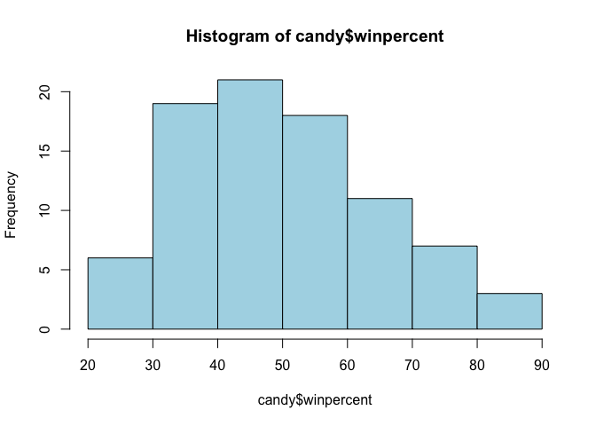
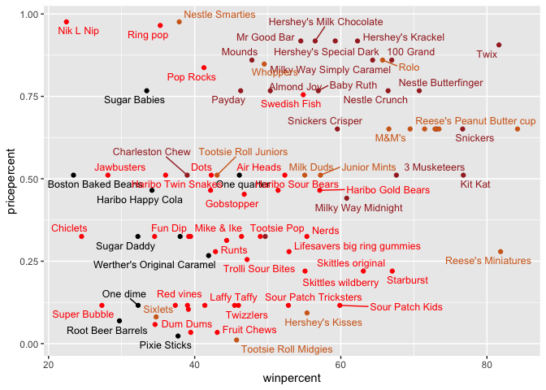
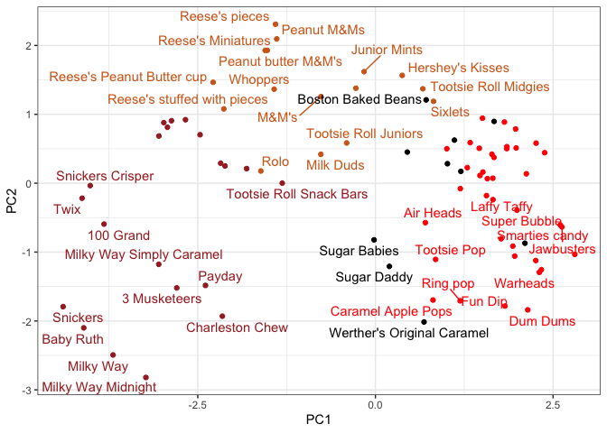
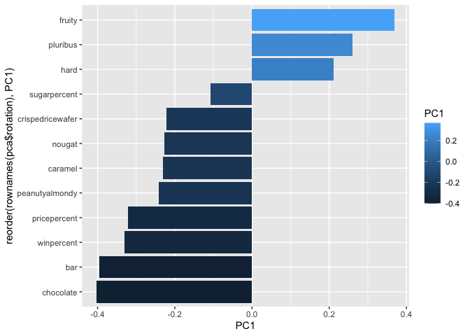

# Halloween Candy Mini-Project
Rocio Silenciario

- [1. Data Import](#1-data-import)
- [2. Explanatory Analysis](#2-explanatory-analysis)
- [3. Winpercent vs Pricepercent](#3-winpercent-vs-pricepercent)
- [4. Correlation Structure](#4-correlation-structure)
- [5. Principal Component Analysis
  (PCA)](#5-principal-component-analysis-pca)

Today we will take a wee step back to some data we can taste, and
explore the correlation structure and principal components of some
Halloween candy.

## 1. Data Import

``` r
candy <- read.csv("candy-data.csv", row.names=1)
head(candy)
```

                 chocolate fruity caramel peanutyalmondy nougat crispedricewafer
    100 Grand            1      0       1              0      0                1
    3 Musketeers         1      0       0              0      1                0
    One dime             0      0       0              0      0                0
    One quarter          0      0       0              0      0                0
    Air Heads            0      1       0              0      0                0
    Almond Joy           1      0       0              1      0                0
                 hard bar pluribus sugarpercent pricepercent winpercent
    100 Grand       0   1        0        0.732        0.860   66.97173
    3 Musketeers    0   1        0        0.604        0.511   67.60294
    One dime        0   0        0        0.011        0.116   32.26109
    One quarter     0   0        0        0.011        0.511   46.11650
    Air Heads       0   0        0        0.906        0.511   52.34146
    Almond Joy      0   1        0        0.465        0.767   50.34755

> Q1. How many different candy types are in this dataset?

``` r
nrow(candy)
```

    [1] 85

> Q2. How many fruity candy types are in the dataset?

``` r
table(candy$fruity)
```


     0  1 
    47 38 

38

> Q3. What is your favorite candy in the dataset and what is it’s
> winpercent value?

``` r
candy["Almond Joy",]$winpercent
```

    [1] 50.34755

> Q4. What is the winpercent value for “Kit Kat”?

``` r
candy["Kit Kat",]$winpercent
```

    [1] 76.7686

> Q5. What is the winpercent value for “Tootsie Roll Snack Bars”?

``` r
candy["Tootsie Roll Snack Bars",]$winpercent
```

    [1] 49.6535

## 2. Explanatory Analysis

We can use the **skimr** package to get a quick overview of a given data
set. This can be useful for the first time you encounter a new data set.

``` r
skimr::skim(candy)
```

|                                                  |       |
|:-------------------------------------------------|:------|
| Name                                             | candy |
| Number of rows                                   | 85    |
| Number of columns                                | 12    |
| \_\_\_\_\_\_\_\_\_\_\_\_\_\_\_\_\_\_\_\_\_\_\_   |       |
| Column type frequency:                           |       |
| numeric                                          | 12    |
| \_\_\_\_\_\_\_\_\_\_\_\_\_\_\_\_\_\_\_\_\_\_\_\_ |       |
| Group variables                                  | None  |

Data summary

**Variable type: numeric**

| skim_variable | n_missing | complete_rate | mean | sd | p0 | p25 | p50 | p75 | p100 | hist |
|:---|---:|---:|---:|---:|---:|---:|---:|---:|---:|:---|
| chocolate | 0 | 1 | 0.44 | 0.50 | 0.00 | 0.00 | 0.00 | 1.00 | 1.00 | ▇▁▁▁▆ |
| fruity | 0 | 1 | 0.45 | 0.50 | 0.00 | 0.00 | 0.00 | 1.00 | 1.00 | ▇▁▁▁▆ |
| caramel | 0 | 1 | 0.16 | 0.37 | 0.00 | 0.00 | 0.00 | 0.00 | 1.00 | ▇▁▁▁▂ |
| peanutyalmondy | 0 | 1 | 0.16 | 0.37 | 0.00 | 0.00 | 0.00 | 0.00 | 1.00 | ▇▁▁▁▂ |
| nougat | 0 | 1 | 0.08 | 0.28 | 0.00 | 0.00 | 0.00 | 0.00 | 1.00 | ▇▁▁▁▁ |
| crispedricewafer | 0 | 1 | 0.08 | 0.28 | 0.00 | 0.00 | 0.00 | 0.00 | 1.00 | ▇▁▁▁▁ |
| hard | 0 | 1 | 0.18 | 0.38 | 0.00 | 0.00 | 0.00 | 0.00 | 1.00 | ▇▁▁▁▂ |
| bar | 0 | 1 | 0.25 | 0.43 | 0.00 | 0.00 | 0.00 | 0.00 | 1.00 | ▇▁▁▁▂ |
| pluribus | 0 | 1 | 0.52 | 0.50 | 0.00 | 0.00 | 1.00 | 1.00 | 1.00 | ▇▁▁▁▇ |
| sugarpercent | 0 | 1 | 0.48 | 0.28 | 0.01 | 0.22 | 0.47 | 0.73 | 0.99 | ▇▇▇▇▆ |
| pricepercent | 0 | 1 | 0.47 | 0.29 | 0.01 | 0.26 | 0.47 | 0.65 | 0.98 | ▇▇▇▇▆ |
| winpercent | 0 | 1 | 50.32 | 14.71 | 22.45 | 39.14 | 47.83 | 59.86 | 84.18 | ▃▇▆▅▂ |

> Q6. Is there any variable/column that looks to be on a different scale
> to the majority of the other columns in the dataset?

It looks like the last column `candy$winpercent` is on a different scale
to all others.

``` r
apply(candy, 2, sd)
```

           chocolate           fruity          caramel   peanutyalmondy 
           0.4987379        0.5001400        0.3731162        0.3731162 
              nougat crispedricewafer             hard              bar 
           0.2765332        0.2765332        0.3834825        0.4338609 
            pluribus     sugarpercent     pricepercent       winpercent 
           0.5026540        0.2827779        0.2857396       14.7143574 

> Q7. What do you think a zero and one represent for the
> candy\$chocolate column?

It represents whether the candy contains chocolate (1 = TRUE) or if it
does not (0 = FALSE).

> Q8. Plot a histogram of winpercent values

``` r
hist(candy$winpercent, col = "lightblue")
```



> Q9. Is the distribution of winpercent values symmetrical?

No

> Q10. Is the center of the distribution above or below 50%?

``` r
summary(candy$winpercent)
```

       Min. 1st Qu.  Median    Mean 3rd Qu.    Max. 
      22.45   39.14   47.83   50.32   59.86   84.18 

Median is below 50%.

> Q11. On average is chocolate candy higher or lower ranked than fruit
> candy?

``` r
choc.inds <- candy$chocolate ==1
choc.candy <- candy[choc.inds,]
choc.win <- choc.candy$winpercent
mean(choc.win)
```

    [1] 60.92153

``` r
fruit.inds <- candy$fruity ==1
fruit.candy <- candy[fruit.inds,]
fruit.win <- fruit.candy$winpercent
mean(fruit.win)
```

    [1] 44.11974

> Q12. Is this difference statistically significant?

``` r
ans <- t.test(choc.win, fruit.win)
```

Yes with a P-value of 2.8713778^{-8} meaning the differences in average
win percents are statistically significant.

> Q13. What are the five least liked candy types in this set?

There are two related functions that can help here. One is the classic
`sort()` and `order()`

``` r
x <- c(5,10,1,4)
sort(x)
```

    [1]  1  4  5 10

``` r
order(x)
```

    [1] 3 4 1 2

``` r
inds <- order(candy$winpercent)
head(candy[inds,], 5)
```

                       chocolate fruity caramel peanutyalmondy nougat
    Nik L Nip                  0      1       0              0      0
    Boston Baked Beans         0      0       0              1      0
    Chiclets                   0      1       0              0      0
    Super Bubble               0      1       0              0      0
    Jawbusters                 0      1       0              0      0
                       crispedricewafer hard bar pluribus sugarpercent pricepercent
    Nik L Nip                         0    0   0        1        0.197        0.976
    Boston Baked Beans                0    0   0        1        0.313        0.511
    Chiclets                          0    0   0        1        0.046        0.325
    Super Bubble                      0    0   0        0        0.162        0.116
    Jawbusters                        0    1   0        1        0.093        0.511
                       winpercent
    Nik L Nip            22.44534
    Boston Baked Beans   23.41782
    Chiclets             24.52499
    Super Bubble         27.30386
    Jawbusters           28.12744

> Q14. What are the top 5 all time favorite candy types out of this set?

``` r
tail(candy[inds,], 5)
```

                              chocolate fruity caramel peanutyalmondy nougat
    Snickers                          1      0       1              1      1
    Kit Kat                           1      0       0              0      0
    Twix                              1      0       1              0      0
    Reese's Miniatures                1      0       0              1      0
    Reese's Peanut Butter cup         1      0       0              1      0
                              crispedricewafer hard bar pluribus sugarpercent
    Snickers                                 0    0   1        0        0.546
    Kit Kat                                  1    0   1        0        0.313
    Twix                                     1    0   1        0        0.546
    Reese's Miniatures                       0    0   0        0        0.034
    Reese's Peanut Butter cup                0    0   0        0        0.720
                              pricepercent winpercent
    Snickers                         0.651   76.67378
    Kit Kat                          0.511   76.76860
    Twix                             0.906   81.64291
    Reese's Miniatures               0.279   81.86626
    Reese's Peanut Butter cup        0.651   84.18029

``` r
inds <- order(candy$winpercent, decreasing=T)
head( candy[inds,], 5)
```

                              chocolate fruity caramel peanutyalmondy nougat
    Reese's Peanut Butter cup         1      0       0              1      0
    Reese's Miniatures                1      0       0              1      0
    Twix                              1      0       1              0      0
    Kit Kat                           1      0       0              0      0
    Snickers                          1      0       1              1      1
                              crispedricewafer hard bar pluribus sugarpercent
    Reese's Peanut Butter cup                0    0   0        0        0.720
    Reese's Miniatures                       0    0   0        0        0.034
    Twix                                     1    0   1        0        0.546
    Kit Kat                                  1    0   1        0        0.313
    Snickers                                 0    0   1        0        0.546
                              pricepercent winpercent
    Reese's Peanut Butter cup        0.651   84.18029
    Reese's Miniatures               0.279   81.86626
    Twix                             0.906   81.64291
    Kit Kat                          0.511   76.76860
    Snickers                         0.651   76.67378

> Q15. Make a first barplot of candy ranking based on winpercent values.

Make a bar plot with ggplot and order it by winpercent values

``` r
library(ggplot2)
ggplot(candy)+
  aes(winpercent, reorder(rownames(candy),winpercent)) +
  geom_col()
```


Let’s add some color now.

``` r
library(ggplot2)
ggplot(candy)+
  aes(x=winpercent, y=reorder(rownames(candy),winpercent), fill = chocolate) +
  geom_col()
```


Here we want a custom color vector to color each bar the way we want -
with `chocolate` and `fruity` candy together with whether it is a bar or
not.

``` r
mycols <- rep("gray", nrow(candy))
mycols[as.logical(candy$chocolate)] <- "chocolate"
mycols[as.logical(candy$fruity)] <- "pink"
mycols[as.logical(candy$bar)] <- "brown"

ggplot(candy)+
  aes(winpercent, reorder(rownames(candy),winpercent)) +
  geom_col(fill=mycols)
```


``` r
ggsave("mybarplot.png", width = 3, height = 10)
```

To insert an image with a preferred size: 

> Q17. What is the worst ranked chocolate candy?

Charleston Chew

> Q18. What is the best ranked fruity candy?

Starbust

## 3. Winpercent vs Pricepercent

``` r
# Pink and gray are too light, lets change to red and black
mycols <- rep("black", nrow(candy))
mycols[as.logical(candy$chocolate)] <- "chocolate"
mycols[as.logical(candy$fruity)] <- "red"
mycols[as.logical(candy$bar)] <- "brown"

library(ggrepel)

# How about a plot of price vs win
ggplot(candy) +
  aes(winpercent, pricepercent, label=rownames(candy)) +
  geom_point(col=mycols) + 
  geom_text_repel(col=mycols, size=3.3, max.overlaps = 9)
```

    Warning: ggrepel: 15 unlabeled data points (too many overlaps). Consider
    increasing max.overlaps



> Q19. Which candy type is the highest ranked in terms of winpercent for
> the least money - i.e. offers the most bang for your buck?

Reese’s Miniatures

> Q20. What are the top 5 most expensive candy types in the dataset and
> of these which is the least popular?

Top 5 most expensive candy types:

``` r
inds <- order(candy$price)
tail(candy[inds,], 5)
```

                           chocolate fruity caramel peanutyalmondy nougat
    Hershey's Special Dark         1      0       0              0      0
    Mr Good Bar                    1      0       0              1      0
    Ring pop                       0      1       0              0      0
    Nik L Nip                      0      1       0              0      0
    Nestle Smarties                1      0       0              0      0
                           crispedricewafer hard bar pluribus sugarpercent
    Hershey's Special Dark                0    0   1        0        0.430
    Mr Good Bar                           0    0   1        0        0.313
    Ring pop                              0    1   0        0        0.732
    Nik L Nip                             0    0   0        1        0.197
    Nestle Smarties                       0    0   0        1        0.267
                           pricepercent winpercent
    Hershey's Special Dark        0.918   59.23612
    Mr Good Bar                   0.918   54.52645
    Ring pop                      0.965   35.29076
    Nik L Nip                     0.976   22.44534
    Nestle Smarties               0.976   37.88719

Least popular candy:

``` r
inds <- order(candy$winpercent)
head(candy[inds,], 1)
```

              chocolate fruity caramel peanutyalmondy nougat crispedricewafer hard
    Nik L Nip         0      1       0              0      0                0    0
              bar pluribus sugarpercent pricepercent winpercent
    Nik L Nip   0        1        0.197        0.976   22.44534

## 4. Correlation Structure

``` r
cij <- cor(candy)
cij
```

                      chocolate      fruity     caramel peanutyalmondy      nougat
    chocolate         1.0000000 -0.74172106  0.24987535     0.37782357  0.25489183
    fruity           -0.7417211  1.00000000 -0.33548538    -0.39928014 -0.26936712
    caramel           0.2498753 -0.33548538  1.00000000     0.05935614  0.32849280
    peanutyalmondy    0.3778236 -0.39928014  0.05935614     1.00000000  0.21311310
    nougat            0.2548918 -0.26936712  0.32849280     0.21311310  1.00000000
    crispedricewafer  0.3412098 -0.26936712  0.21311310    -0.01764631 -0.08974359
    hard             -0.3441769  0.39067750 -0.12235513    -0.20555661 -0.13867505
    bar               0.5974211 -0.51506558  0.33396002     0.26041960  0.52297636
    pluribus         -0.3396752  0.29972522 -0.26958501    -0.20610932 -0.31033884
    sugarpercent      0.1041691 -0.03439296  0.22193335     0.08788927  0.12308135
    pricepercent      0.5046754 -0.43096853  0.25432709     0.30915323  0.15319643
    winpercent        0.6365167 -0.38093814  0.21341630     0.40619220  0.19937530
                     crispedricewafer        hard         bar    pluribus
    chocolate              0.34120978 -0.34417691  0.59742114 -0.33967519
    fruity                -0.26936712  0.39067750 -0.51506558  0.29972522
    caramel                0.21311310 -0.12235513  0.33396002 -0.26958501
    peanutyalmondy        -0.01764631 -0.20555661  0.26041960 -0.20610932
    nougat                -0.08974359 -0.13867505  0.52297636 -0.31033884
    crispedricewafer       1.00000000 -0.13867505  0.42375093 -0.22469338
    hard                  -0.13867505  1.00000000 -0.26516504  0.01453172
    bar                    0.42375093 -0.26516504  1.00000000 -0.59340892
    pluribus              -0.22469338  0.01453172 -0.59340892  1.00000000
    sugarpercent           0.06994969  0.09180975  0.09998516  0.04552282
    pricepercent           0.32826539 -0.24436534  0.51840654 -0.22079363
    winpercent             0.32467965 -0.31038158  0.42992933 -0.24744787
                     sugarpercent pricepercent winpercent
    chocolate          0.10416906    0.5046754  0.6365167
    fruity            -0.03439296   -0.4309685 -0.3809381
    caramel            0.22193335    0.2543271  0.2134163
    peanutyalmondy     0.08788927    0.3091532  0.4061922
    nougat             0.12308135    0.1531964  0.1993753
    crispedricewafer   0.06994969    0.3282654  0.3246797
    hard               0.09180975   -0.2443653 -0.3103816
    bar                0.09998516    0.5184065  0.4299293
    pluribus           0.04552282   -0.2207936 -0.2474479
    sugarpercent       1.00000000    0.3297064  0.2291507
    pricepercent       0.32970639    1.0000000  0.3453254
    winpercent         0.22915066    0.3453254  1.0000000

``` r
library(corrplot)
```

    corrplot 0.95 loaded

``` r
cij <- cor(candy)
corrplot(cij)
```


> Q22. Examining this plot what two variables are anti-correlated
> (i.e. have minus values)?

Chocolate and fruity are negatively correlated

``` r
round(cij["chocolate", "fruity"], 2)
```

    [1] -0.74

> Q23. Similarly, what two variables are most positively correlated?

Chocolate and win percent

``` r
round(cij["chocolate", "winpercent"], 2)
```

    [1] 0.64

## 5. Principal Component Analysis (PCA)

We need to be sure to scale our input `candy` data before PCA as we have
the `winpercent` column on a different scale to all others in the data
set.

``` r
pca <- prcomp(candy, scale=TRUE)
summary(pca)
```

    Importance of components:
                              PC1    PC2    PC3     PC4    PC5     PC6     PC7
    Standard deviation     2.0788 1.1378 1.1092 1.07533 0.9518 0.81923 0.81530
    Proportion of Variance 0.3601 0.1079 0.1025 0.09636 0.0755 0.05593 0.05539
    Cumulative Proportion  0.3601 0.4680 0.5705 0.66688 0.7424 0.79830 0.85369
                               PC8     PC9    PC10    PC11    PC12
    Standard deviation     0.74530 0.67824 0.62349 0.43974 0.39760
    Proportion of Variance 0.04629 0.03833 0.03239 0.01611 0.01317
    Cumulative Proportion  0.89998 0.93832 0.97071 0.98683 1.00000

First main result figure is my “PCA plot”

``` r
ggplot(pca$x) +
  aes(PC1, PC2, label=rownames(pca$x))+
  geom_point(col=mycols)+
  geom_text_repel(max.overlaps=6, col=mycols)+
  theme_bw()
```

    Warning: ggrepel: 43 unlabeled data points (too many overlaps). Consider
    increasing max.overlaps



The second main PCA result is in the `pca$rotation` we can plot this to
generate a so-called “loadings” plot.

``` r
ggplot(pca$rotation)+
  aes(PC1, rownames(pca$rotation))+
  geom_col()
```


``` r
ggplot(pca$rotation)+
  aes(PC1, reorder(rownames(pca$rotation), PC1), fill = PC1)+
  geom_col()
```



> Q24. What original variables are picked up strongly by PC1 in the
> positive direction? Do these make sense to you?

Pluribus, hard, and fruity.
